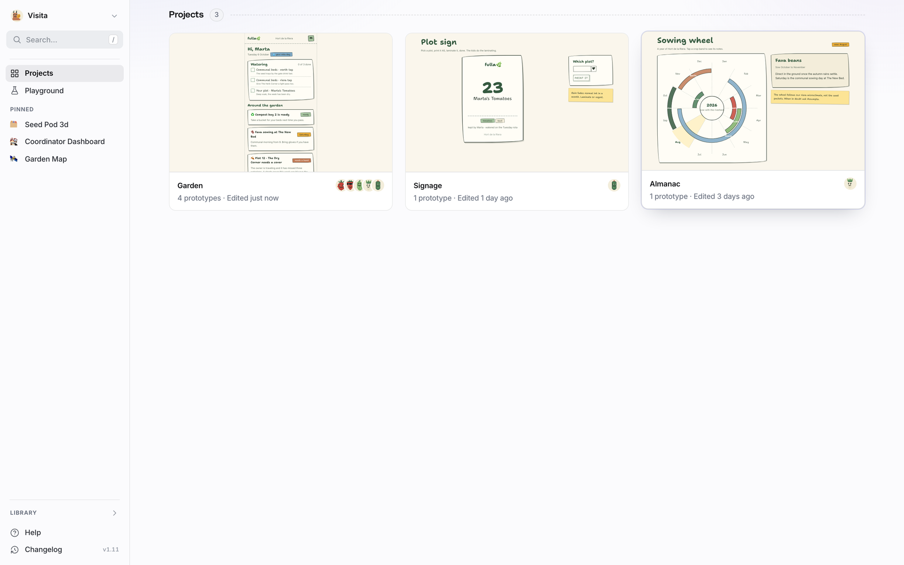
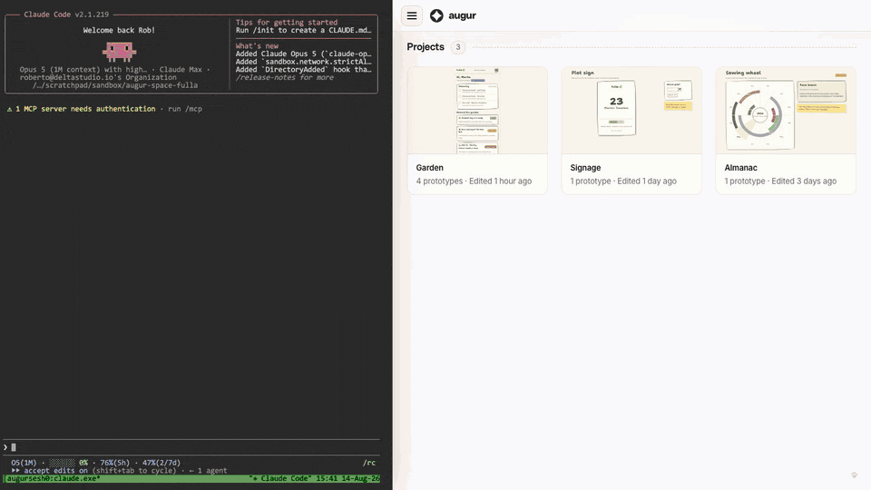
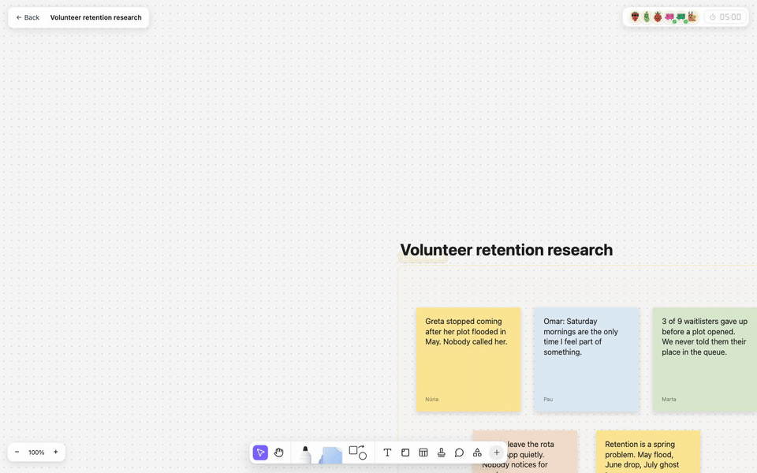
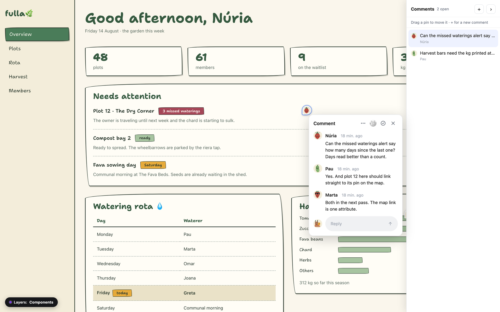
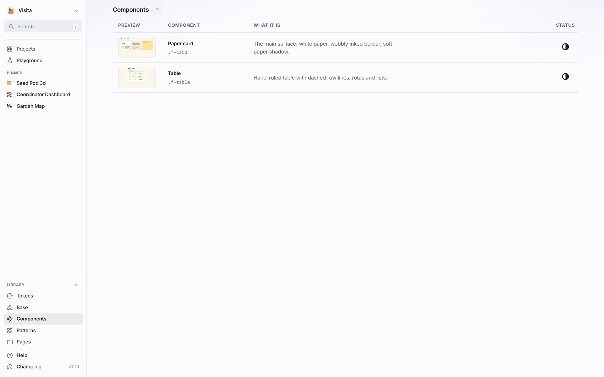
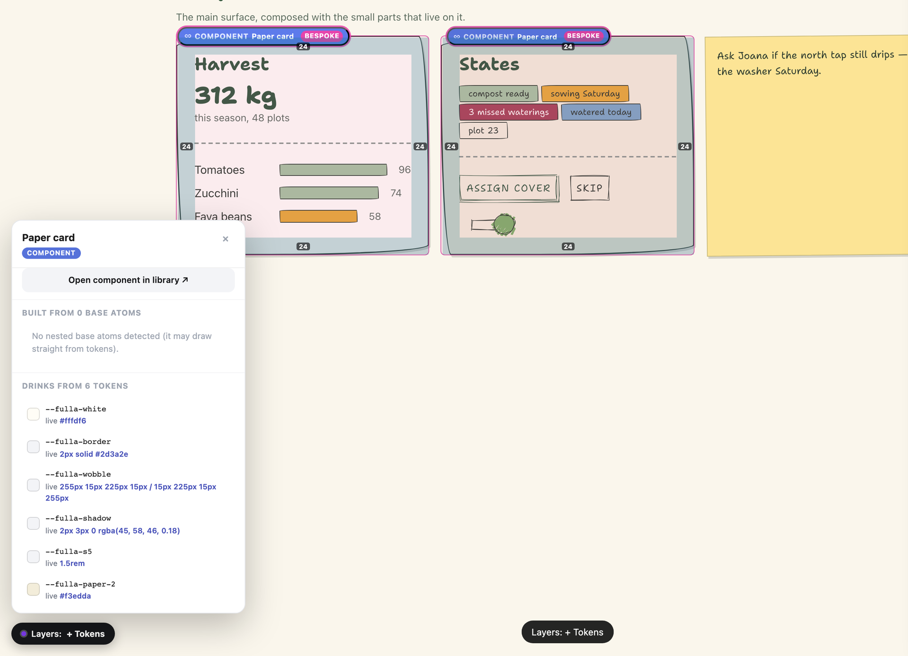

# Augur

A prototype and research repository for product teams. Real, clickable
prototypes on one site, with login, comments and live boards on top.
Underneath it is all git and static HTML.

**See it running: [demo.augur.works](https://demo.augur.works)**, sign in with
`visita@fulla.demo` / `regadora`. It resets every night, so scribble away.



The demo runs [Fulla](https://github.com/andratwiro/augur-space-fulla), an
invented community garden product. That repo doubles as the starter space, so
everything below works against it.

## How a prototype gets made

There is no editor. A prototype is briefed, not drawn — you describe the screen
the way you would brief a designer, and an agent builds it as a real page in
the space, using the design system like anyone else on the team.

The brief that made [Seed swap](https://demo.augur.works/garden/seed-swap/):

```text
Seed swap — a noticeboard where members offer saved seeds and claim each
other's. One screen. A board of offer cards: who, what, roughly how many,
which plot they came from — "Fava beans, saved from plot 12, ~40 seeds".
Claiming an offer keeps the card on the board but settles it down visually;
the swap happens at the shed, not in the app. The empty state suggests the
first action instead of apologizing. Warm and hand-made like the rest of
Fulla — use the fulla design system, don't invent new vocabulary. Add the
one-line meta description. No routing, no backend; seed the board with a
handful of believable offers.
```



That is Claude Code in the capture; any coding agent that can read the
contracts in [agents/](./agents/) does the same job. Screens in the demo space
carry the session that made them — [open the repo and read one](https://github.com/andratwiro/augur-space-fulla/tree/main/garden/prompts).
The follow-ups read like design direction, because that is what they are.

## Boards where the prototypes run

Drop a live prototype next to the stickies and drive it. Everyone on the board sees the same screen state. Agents join as pixel mascots and work next to you. Up close: the specimen spins inside its tile, a teammate's cursor works the area, and Menta the agent strolls over to watch.



## Comments on the real pixels

Shift+C on any prototype opens review mode. A pin sticks to the element it
talks about, the thread keeps everyone's face on it, and the design system
shows through as a layer.



## Build your design library

The same space that holds your prototypes holds your design system. Tokens,
base, components, patterns and pages each get a tier, every entry is a plain
HTML page you write, and the site renders it with a live preview and the class
names it documents. A small registry gives the review overlay the same
vocabulary, so a pin on a prototype knows which component it landed on.



Up close, at the tokens depth: paddings shade in place like devtools, and the
panel lists the tokens a component drinks with their live values. Token usage
is tracked to the pixel across every prototype that links the system.



## Try it locally

```bash
git clone https://github.com/andratwiro/augur.git
git clone https://github.com/andratwiro/augur-space-fulla.git
cd augur-space-fulla
node ../augur/scripts/dev.mjs
```

That is the full shell on your machine, with about a second of hot reload. The
engine has no runtime dependencies, plain `node` is enough. Prototypes are
self-contained static HTML and also open straight from disk.

## How it is put together

- **A space is a git repo.** Your design system and your prototypes, nothing
  else. Only the contents of `prototypes/` folders and the gallery tiers ever
  publish. The research notes sitting next to them stay private by
  construction.
- **The engine is this repo.** It composes spaces into one static site and
  runs the overlay worker on Cloudflare. It carries no secrets and no content.
- **A private deploy shell holds your instance.** The engine pin, the user
  list, every secret. Engine fixes reach your instance by pin bump, never by
  forking.
- **Publishing is `augur publish`.** Seconds, atomic, straight from your
  clone. A git push saves and shares work without deploying anything.

## Run your own

[INSTALL.md](./INSTALL.md) is the whole recipe, written to be executed top to
bottom by a person or an agent. About an hour, most of it waiting on DNS
and CI.

## Docs

- [CLAUDE.md](./CLAUDE.md), the engine conventions
- [agents/](./agents/), the contracts for agents working in a space
- [CANVAS.md](./CANVAS.md), the board engine and how agents co-work on it
- [CONTRIBUTING.md](./CONTRIBUTING.md), fork to PR, never fork to deploy

## License

MIT. See [LICENSE](./LICENSE).
