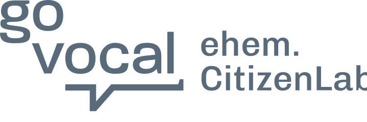

# GoVocal UI — component catalog

Static-HTML reproductions of the product's `@citizenlab/cl2-component-library`
primitives. Every snippet uses classes from `govocal-ui.css` and tokens from
`govocal-tokens.css`. **Provenance:** all values transcribed from
`CitizenLabDotCo/citizenlab @ 5d67730`, `front/app/component-library/`.

> **Golden rule:** never hardcode a brand colour. Use `var(--gv-tenant-primary)`,
> `var(--gv-tenant-secondary)`, `var(--gv-tenant-text)` (city-configurable) and the
> semantic tokens. This is what lets `?theme=` re-skin a prototype per city.

Storybook (visual ground-truth): each component has a `*.stories.tsx` in its
source folder; run the library's Storybook locally to compare pixel-for-pixel.

---

## Setup

A **prototype** copies the assets in (it's self-contained). A **library demo**
(`components/`, `pages/`) instead references canonical via `../../skills/govocal-ui/`
— never copy there. For a prototype, copy `govocal-tokens.css`,
`govocal-primitives.css`, `govocal-ui.css`, `govocal-themes.js` (+ `govocal-bo.css`
for back-office), then:

```html
<link rel="stylesheet" href="govocal-tokens.css" />
<link rel="stylesheet" href="govocal-ui.css" />   <!-- @imports govocal-primitives.css -->
<script src="govocal-themes.js" defer></script>   <!-- ?theme= switcher + picker -->
<body class="gv-root"> … </body>
```

---

## Button — `components/Button`

`.gv-btn` + a style + optional `.size-m|l|xl` + optional `.full`.

```html
<button class="gv-btn primary"><span class="gv-btn__label">Submit</span></button>
<button class="gv-btn primary-outlined">Cancel</button>
<button class="gv-btn secondary">Secondary</button>
<button class="gv-btn white">On colour</button>
<button class="gv-btn text">Text button</button>
<button class="gv-btn delete">Delete</button>
<button class="gv-btn admin-dark size-m">Admin</button>
<button class="gv-btn primary" disabled>Disabled</button>
<button class="gv-btn primary processing"><span class="gv-btn__label">Saving</span><span class="gv-spinner sm"></span></button>
```

- **Styles:** `primary` (tenant primary, white text), `primary-outlined`,
  `primary-inverse`, `secondary`, `white` (shadow), `text`, `admin-dark`,
  `admin-dark-outlined`, `admin-dark-text`, `delete` (red600).
- **Sizes:** default `9px 18px`/16px · `size-m` `13px 22px`/16px·500 (prominent CTA) ·
  `size-l` `13px 24px`/21px · `size-xl` `15px 26px`/21px (lh 28). Radius 3px.
- **States:** `:hover` darkens (approximated via `filter: brightness`),
  `disabled` → opacity .37, `processing` hides the label and shows `.gv-spinner`.

## Text input / textarea — `defaultInputStyle`, `components/Input`

```html
<label class="gv-label" for="email">Email</label>
<input class="gv-input" id="email" type="email" placeholder="you@example.com" />

<input class="gv-input error" value="nope" aria-invalid="true" />
<p class="gv-error-text">⚠ Enter a valid email address.</p>

<input class="gv-input" disabled value="Disabled" />
<textarea class="gv-textarea" placeholder="Your idea…"></textarea>
```

- Height 48px, padding 12px, 1px `--gv-border-dark`, radius 3px, font 16px.
- Hover → border `#000`. Focus → 2px tenant-primary outline.
  `.error` → red600 border; error+focus → red glow (`--gv-shadow-error`).
- `.size-small` → 14px / 10px padding.

## Title & Text — `components/Title`, `components/Text`

```html
<h1 class="gv-title h1">Page title</h1>   <!-- h1=30 h2=25 h3=21 h4=18 h5=16 h6=14, bold, lh 1.3 -->
<p class="gv-text bodyM">Body copy.</p>    <!-- bodyL=18/600 bodyM=16 bodyS=14 bodyXs=12, lh 1.5 -->
<p class="gv-text bodyS gv-text--secondary">Muted secondary text.</p>
```

## Checkbox — `components/Checkbox`

Checked state is **success green** (`--gv-success`), not the tenant primary.

```html
<label class="gv-checkbox">
  <input type="checkbox" checked />
  <span class="box"><span class="check">✓</span></span>
  Keep me updated
</label>
```

24px box, radius 3px, border `--gv-border-dark`; hover border `#000`;
focus outline tenant-primary.

## Radio — `components/Radio`

```html
<label class="gv-radio">
  <input type="radio" name="opt" checked /><span class="circle"></span> Option A
</label>
<label class="gv-radio">
  <input type="radio" name="opt" /><span class="circle"></span> Option B
</label>
```

20px circle, 12px inner dot (`--gv-tenant-primary`). Hover border `#000`.

## Toggle — `components/Toggle`

```html
<label class="gv-toggle">
  <input type="checkbox" checked /><span class="track"></span>
  <span class="label">Notifications</span>
</label>
```

Track knob 21px; **off** `#ccc`, **on** `--gv-success`; disabled → opacity .25.

## Badge — `components/Badge`

```html
<span class="gv-badge" style="color: var(--gv-teal-500)">New</span>
<span class="gv-badge inverse" style="color: var(--gv-success)">Live</span>
```

Uppercase, 12px, weight 500, radius 3px. Outlined by default (`color` sets the
border+text); `.inverse` fills with that colour and white text.

## StatusLabel — `components/StatusLabel`

Filled status pill; set the background via `--bg`.

```html
<span class="gv-status-label" style="--bg: var(--gv-success)">Published</span>
<span class="gv-status-label" style="--bg: var(--gv-orange-500)">Pending</span>
<span class="gv-status-label outlined">Draft</span>
```

## Chip — `.gv-chip` (`govocal-ui.css`)

Small rounded-pill tag (grey-100, 26px tall) for inline metadata — a location, a
category, a count. Optional leading icon.

```html
<span class="gv-chip"><span data-gv-icon="location-simple" aria-hidden="true"></span> District 4</span>
```

## Spinner — `components/Spinner`

```html
<span class="gv-spinner"></span>          <!-- 32px / 3px / #666 -->
<span class="gv-spinner sm"></span>       <!-- 20px -->
```

## Card & Divider

```html
<div class="gv-card hoverable"> … </div>   <!-- white, radius 3px, soft shadow, hover lift -->
<hr class="gv-divider" />
```

## Icons — `govocal-icons.js` (`components/Icon`)

The real GoVocal icon set (Material-Design-derived paths), transcribed verbatim from
`components/Icon/index.tsx`. Curated subset of what the product UI actually uses
(the live count + sorted list is `GVIcons.names` — it grows as we transcribe more).

```html
<script src="govocal-icons.js" defer></script>

<!-- Drop an icon anywhere; it fills with an inline <svg class="gv-icon"> -->
<span data-gv-icon="vote-up"></span>                 <!-- decorative → auto aria-hidden -->
<span data-gv-icon="comment" aria-label="Comments"></span>  <!-- meaningful → label it -->
<button class="gv-iconbtn" aria-label="Search"><span data-gv-icon="search"></span></button>
```

- **Sizing/colour:** `.gv-icon` is `1em` and `fill: currentColor` — set the parent's
  `font-size`/`color` and the icon follows (so it re-themes with `--gv-tenant-*`).
- **API:** `window.GVIcons.svg("search")` → markup string; `.names` → sorted list;
  `.render(root)` → rescan after injecting new `[data-gv-icon]` nodes.
- **Names** (representative — `GVIcons.names` is the authoritative live list): navigation/UI — `search close menu dots-horizontal plus minus check
  edit delete settings filter refresh link open-in-new download send share
  chevron-{up,down,left,right} arrow-{up,down,left,right}`; participation — `vote-up
  vote-down idea comment comments basket basket-plus survey initiatives volunteer flag
  bookmark bookmark-outline eye eye-off stars`; meta — `user user-circle group calendar
  calendar-range clock location-simple gps map info-outline info-solid alert-circle
  check-circle lock key email notification home trend-up money-bag timeline pen label`;
  account menu (transcribed live from the user dropdown) — `shield` (Manage platform)
  `cogs` (My settings) `power` (Sign out); admin sidebar (live `#sidebar` glyphs) —
  `admin-{dashboard,projects,input,community,inspiration,messaging,reporting,users,pages,tools,settings,notifications,support,back}`.
- **More icons exist** in the repo (~130 total incl. SSO + other specialized glyphs); extend
  `govocal-icons.js` from `Icon/index.tsx` @ `5d67730` following the same discipline.

## Avatar & avatar stack — `.gv-avatar` / `.gv-bubbles` (`govocal-primitives.css`)

The circular participant avatar and the overlapping social-proof stack + count, reused
by the hero, project cards, spotlight, perspectives and more.

```html
<span class="gv-avatar"></span>                 <!-- single 32px circle; set background-image for a face -->
<div class="gv-bubbles" aria-label="145 participants">
  <span class="av"></span><span class="av"></span><span class="av"></span>
  <span class="gv-bubbles__label">145 participants</span>
</div>
```

## Progress bar — `.gv-progress` (`govocal-primitives.css`)

Generic tenant-tinted track + fill; `__fill` width is the value. Used for time-remaining,
proposal thresholds, survey completion.

```html
<div class="gv-progress" role="progressbar" aria-valuenow="18" aria-valuemin="0" aria-valuemax="100" aria-label="Time elapsed">
  <div class="gv-progress__fill" style="width:18%"></div>
</div>
```

## Tabs — `.gv-tabs` / `.gv-tab` (`govocal-ui.css`)

Underline tab strip with optional `.ct` count, used by the homepage/projects toolbars.

```html
<div class="gv-tabs" role="tablist" aria-label="Publication status">
  <button class="gv-tab" role="tab" aria-selected="true">Published <span class="ct">(21)</span></button>
  <button class="gv-tab" role="tab" aria-selected="false">Archived <span class="ct">(1)</span></button>
</div>
```

## Filter control — `.gv-filter-btn` / `.gv-filter-pill` (`govocal-ui.css`)

The two filter-trigger atoms: the neutral toolbar button (`.gv-filter-btn`, Tag/Area
selectors) and the tenant-primary pill dropdown (`.gv-filter-pill`, the /events filters).

```html
<button class="gv-filter-btn">All topics</button>
<button class="gv-filter-pill" aria-haspopup="listbox" aria-expanded="false" aria-label="Date">Date</button>
```

## Segmented toggle — `.gv-viewseg` / `.gv-pviewtoggle` (`govocal-ui.css`)

Two segmented view-switchers: the grey-track `.gv-viewseg` (List/Map on a project page)
and the white-wrapper own-shadow `.gv-pviewtoggle` (List/Perspective on Perspectives).

```html
<div class="gv-viewseg" role="tablist" aria-label="View ideas as">
  <button class="gv-viewseg__tab" role="tab" aria-selected="true"><span data-gv-icon="menu" aria-hidden="true"></span>List</button>
  <button class="gv-viewseg__tab" role="tab" aria-selected="false"><span data-gv-icon="map" aria-hidden="true"></span>Map</button>
</div>
```

## Search field — `.gv-searchfield` (`govocal-primitives.css`)

Full-width search wrapper: a `.gv-input` with a right-aligned magnifier glyph.

```html
<div class="gv-searchfield">
  <label class="gv-sr-only" for="q">Search</label>
  <input class="gv-input" id="q" type="search" placeholder="Search projects and folders" />
  <span class="gv-searchfield__icon" aria-hidden="true"><span data-gv-icon="search"></span></span>
</div>
```

---

## Select — `.gv-select` (`components/Select`)

Native `<select>` wearing `defaultInputStyle` (same as `.gv-input`) + a chevron-down
glyph (`fill #999` → black on hover/focus). 48px tall. Wrap the `<select>` in
`.gv-select`. Give the first option `.placeholder` to render it greyed. Modifiers:
`.error`, `.size-small`.

```html
<div class="gv-select">
  <select aria-label="Sort by">
    <option class="placeholder" value="" selected disabled hidden>Choose…</option>
    <option>Most recent</option>
    <option>Most discussed</option>
  </select>
</div>
```

## Table — `.gv-table` (`components/Table`)

`<table>` at 14px, text colour `--gv-primary` (#044D6C), `border-collapse:separate`;
header row underlined with grey200; 12px cell padding. Inner borders are opt-in:
`.borders-header-cells`, `.borders-body-rows`, `.borders-body-cells`. Sortable header
cells take `.clickable` (hover tint).

```html
<table class="gv-table borders-body-rows">
  <thead><tr><th class="clickable">Name</th><th>Status</th></tr></thead>
  <tbody>
    <tr><td>Bike lane consultation</td><td>Open</td></tr>
    <tr><td>Park redesign</td><td>Closed</td></tr>
  </tbody>
</table>
```

## Tooltip — `.gv-tooltip` (`components/Tooltip`)

Tippy **light**-theme bubble (white, text `#26323d`, 4px radius, layered tippy shadow,
8px arrow) reproduced CSS-only — shows on hover/focus of the wrapper, placement top.
Wrap a focusable trigger and put the bubble alongside it.

```html
<span class="gv-tooltip" tabindex="0">
  <span data-gv-icon="info"></span>
  <span class="gv-tooltip__bubble" role="tooltip">Only admins can see this field.</span>
</span>
```

---

# Composed components (Components tab)

Section-level blocks assembled from the primitives above. Full, copy-ready demos live
in `components/<name>/index.html` (and ship to `/components/`); the recall index is
`components/manifest.md`. Skeletons below — open the demo for the complete markup.

> **Front office vs back office.** Everything below the next divider is **front-office**
> (resident-facing, city-themed via `?theme=`). The **back-office** (staff) surface uses
> GoVocal's own fixed teal/navy theme — load `govocal-bo.css` and scope under `.gv-bo`,
> which remaps `--gv-tenant-*` so the same primitives render in BO colours.

## Back-office sidebar — `.gv-bo-side` (`components/bo-sidebar/`)

Standalone, responsive. **Extended** 224px (teal brand band + navy nav, 24px blue
icons + white labels, active = dark cell). Collapses to an **80px icon rail** at
≤1200px — add `.is-rail` to force it, or `data-gv-side-auto` + the matchMedia snippet
to auto-toggle. Labels go in `.gv-bo-nav__label` (hidden in the rail); the count badge
overlaps the icon when collapsed.

```html
<nav class="gv-bo-side" aria-label="Admin">   <!-- + .is-rail to collapse to 80px -->
  <a class="gv-bo-side__brand" href="#">
    <span class="gv-bo-side__logo"><span data-gv-icon="arrow-left"></span></span>
    <span class="gv-bo-side__brandtext">To platform</span>
  </a>
  <div class="gv-bo-nav">
    <a class="gv-bo-nav__item is-active" href="#" title="Projects">
      <span class="gv-bo-nav__icon" data-gv-icon="survey"></span><span class="gv-bo-nav__label">Projects</span></a>
    <!-- …more items… -->
  </div>
  <div class="gv-bo-nav gv-bo-nav--bottom">
    <a class="gv-bo-nav__item" href="#" title="Notifications">
      <span class="gv-bo-nav__icon" data-gv-icon="notification"></span><span class="gv-bo-nav__label">Notifications</span><span class="gv-bo-count">29</span></a>
  </div>
</nav>
```
```js
// auto-collapse at 1200px (the product's breakpoint)
const mq = matchMedia("(max-width: 1200px)");
const sync = () => document.querySelectorAll("[data-gv-side-auto], .gv-bo-shell")
  .forEach((el) => el.classList.toggle("is-rail", mq.matches));
mq.addEventListener("change", sync); sync();
```

## Back-office app shell — `.gv-bo-shell` (`components/bo-app-shell/`)

The persistent staff chrome: navy sidebar + project top-bar + project tabs. Scope the
whole app under `.gv-bo`; mount the page in `.gv-bo-main`. Reuses `.gv-btn.admin-dark`
(primary, `#044D6C`), `.gv-btn.secondary-outlined`, `.gv-iconbtn` — no new button code.

```html
<div class="gv-bo gv-bo-shell">
  <nav class="gv-bo-side" aria-label="Admin">
    <a class="gv-bo-side__brand" href="#"><span class="gv-bo-side__logo">…</span> To platform</a>
    <div class="gv-bo-nav">
      <a class="gv-bo-nav__item is-active" href="#"><span class="gv-bo-nav__icon" data-gv-icon="survey"></span>Projects</a>
      <!-- …more items… -->
    </div>
    <div class="gv-bo-nav gv-bo-nav--bottom">
      <a class="gv-bo-nav__item" href="#"><span class="gv-bo-nav__icon" data-gv-icon="notification"></span>Notifications<span class="gv-bo-count">29</span></a>
    </div>
  </nav>
  <div class="gv-bo-main">
    <header class="gv-bo-topbar">
      <div class="gv-bo-topbar__row">
        <div>
          <h1 class="gv-bo-topbar__title">Project title</h1>
          <div class="gv-bo-meta"><span class="gv-bo-meta__item"><span class="gv-icon" data-gv-icon="eye"></span>Public</span></div>
        </div>
        <div class="gv-bo-topbar__actions">
          <button class="gv-btn admin-dark"><span data-gv-icon="check"></span><span class="gv-btn__label">Published</span></button>
        </div>
      </div>
      <nav class="gv-bo-tabs" aria-label="Project">
        <a class="gv-bo-tab is-active" href="#">Timeline</a>
        <a class="gv-bo-tab" href="#">Audience</a>
      </nav>
    </header>
    <!-- page content here -->
  </div>
</div>
```

---

## Back-office config forms — `.gv-bo-*` (`pages/bo-project-phase/`)

The deep project-configuration editor (`/admin/projects/<id>/…`). All values
source-grounded from the live captures (`bo-phase-setup`, `bo-project-general`,
`bo-project-audience`, `bo-project-events`); verified via the `bo-project-phase/*`
checkpoints. Everything scopes under `.gv-bo` so the BO palette applies.

- **Headings:** `.gv-bo-formhead` (21/700 blue), `.gv-bo-subhead` (18/700 blue),
  `.gv-bo-caption` (14/700 cool-grey), `.gv-bo-qlabel` (16/600 blue), `.gv-bo-help`
  (14 secondary).
- **Controls:** reuse `.gv-input`/`.gv-textarea`, `.gv-toggle`, `.gv-radio`
  (BO selected-dot is success-green via the `.gv-bo` scope), `.gv-checkbox`.
  New: `.gv-bo-select` (native select styled like `.gv-input`).
- **`.gv-bo-banner`** — light-teal info callout (icon + text, `--gv-teal-100`).
- **`.gv-bo-methods` / `.gv-bo-methodcard`(`.is-selected`)** — participation-method
  / view picker grid (icon · title · desc; selected = `--gv-teal-75` + blue border).
- **`.gv-bo-togglerow`** — label/help on the left, `.gv-toggle` pinned right; rows
  divided by a top border.
- **`.gv-bo-tags` / `.gv-bo-tag`(`.is-selected`)** — selectable tag chips (5px radius).
- **`.gv-bo-imageup`** (`__preview`/`__remove`) + **`.gv-bo-dropzone`** — image upload.
- **`.gv-bo-table`** (`thead th`, `__person`/`__avatar`/`__name`/`__sub`/`__opts`) +
  **`.gv-bo-toolbar`** (`.gv-bo-search`) + **`.gv-bo-pager`** — admin data table.
- **`.gv-bo-pane` / `.gv-bo-card`** — white card on a grey gutter (Messaging/Events).
- **`.gv-bo-empty`** (`__icon`/`__title`/`__text`) — empty state.
- **`.gv-bo-eventrow`** (`__main`/`__title`/`__dates`/`__count`/`__actions`) — events list.
- New button variant: **`.gv-btn.success`** (green CTA, `--gv-green-600`) + size **`.gv-btn.size-s`**.

The page wires the six project top-tabs (General · Timeline · Audience · Messaging ·
Events · 360 Input) to swap panels in JS, and the **Timeline → phase** panel wires four
`.pp-sub` sub-tabs (Setup · Input manager · Input form · Insights) — a clickable
starting point for BO flows.

### Phase sub-tab views (grounded on `bo-project-ideas`, `bo-input-form-builder`, `bo-phase-insights`)

- **Input manager** — `.gv-bo-imgr` (216px rail + table grid):
  - **`.gv-bo-table.is-bordered`** — posts-table card variant: 1px `--gv-grey-300`
    outline + 3px radius, even rows `--gv-bo-row-alt`. Blue 700 headers (the base
    `thead th` is now the grounded `--gv-bo-primary`/12px). `__check` (narrow checkbox
    col), `__num` (centred count cols), `__title` (idea link). **`.gv-bo-th--sort`**
    (`.is-sorted` → `--gv-grey-200` tint) = sortable header.
  - **`.gv-bo-filterrail`** (`__tabs`/`__tab`/`__group`/`__item`(`.is-active`)/`__count`)
    — bordered Timeline/Tags/Status facet rail with per-phase counts.
  - **`.gv-bo-banner--ai`** — the teal callout with a right-pushed `__cta`.
  - **`.gv-bo-headrow`** (`__title`/`__actions`), **`.gv-bo-count-line`**,
    **`.gv-bo-link`** (icon + text link, e.g. Exports).
- **Input form** — **`.gv-bo-eyebrow`** (uppercase section caption) +
  **`.gv-bo-importlist`** / **`.gv-bo-importcard`** (`__icon` light-blue tile · `__main`
  `__title`/`__desc` · `__actions` link + primary button). Source cards (Paper-OCR,
  Spreadsheet) measured at 1px `--gv-grey-300`/3px/12px.
- **Insights** (SHARED — both surfaces) — **`.gv-bo-statgrid`** auto-fill grid of
  **`.gv-bo-stat`** cards (`__top` label + `__icon`, `__num` 34/700 blue, `__delta`
  7-day change). White/3px/`var(--gv-shadow)`/17px. **`.gv-bo-chartcard`**
  (`__title`/`__sub` + inline `<svg>` area plot). Header pairs Download with a green
  `.gv-btn.success` AI-analysis CTA.

---

## Header + nav — `.gv-header` (`components/header-nav/`)

Responsive 78px chrome. CSS-only: dropdowns and the “Mehr ···” overflow are
`<details>`; the mobile drawer (`< 860px`) is `<details class="gv-nav-m">`. No JS.
Markup mirrors the live product — `header#e2e-navbar`, a `<nav aria-label="Primäre">`
primary-nav landmark around `<ul class="gv-nav__list">`, and the real GoVocal
filled three-bar hamburger icon.

```html
<header id="e2e-navbar" class="gv-header sticky">
  <div class="gv-header__inner">
    <a class="gv-brand" href="#" data-gv-logo aria-label="Home" aria-current="page"></a>  <!-- logo slot (themes per city) -->
    <nav class="gv-nav" aria-label="Primäre">
      <ul class="gv-nav__list">
        <li><a class="gv-nav__link" href="#" aria-current="page">Willkommen</a></li>
        <li><details class="gv-nav__dd"><summary class="gv-nav__link">Beteiligungsprojekte <svg class="gv-nav__chev">…</svg></summary>
          <div class="gv-nav__menu"><a href="#">Alle Projekte</a>…</div></details></li>
        <li><a class="gv-nav__link" href="#">Mitmachen</a></li>
        <li><details class="gv-nav__dd right"><summary class="gv-nav__link">Mehr <svg>…</svg></summary>
          <div class="gv-nav__menu">…</div></details></li>
      </ul>
    </nav>
    <div class="gv-header__actions">
      <button class="gv-iconbtn gv-desktop-only" aria-label="Suche">…</button>
      <button class="gv-btn primary gv-desktop-only">Anmelden</button>
      <details class="gv-nav-m">
        <summary aria-label="Mobiles Navigationsmenü anzeigen">
          <svg width="24" height="24" viewBox="0 0 24 24" fill="currentColor" aria-hidden="true"><path d="M3,6H21V8H3V6M3,11H21V13H3V11M3,16H21V18H3V16Z"/></svg>
        </summary>
        <nav class="gv-nav-m__panel">…links… <button class="gv-btn primary full">Anmelden</button></nav>
      </details>
    </div>
  </div>
</header>
```
- The bar is **full-width** (`.gv-header__inner` is `width:100%`, `box-sizing:border-box`):
  logo flush-left, actions flush-right — like the live product — while page content stays capped.
- Active link → tenant **top-bar + subtle tinted cell** via `aria-current="page"`. **Not bold**
  (weight stays 500, matching the product). Add `sticky` to pin.
- Logo: `data-gv-logo` (themes per city) or drop a literal `<svg>`/`` in `.gv-brand`.
- Primary nav is a `<nav aria-label="Primäre">` landmark; the `<ul>` carries `.gv-nav__list`.
- Hamburger uses the real GoVocal filled three-bar icon (`M3,6H21V8H3V6…`), not a generic stroked one.

### Signed-out vs signed-in — one component, a state switch

Same header; the **actions** cluster swaps. Wrap each cluster in `.gv-auth-out` /
`.gv-auth-in` and set `data-auth="out" | "in"` on a root (e.g. `<body>`): the matching
cluster shows, the other hides (`display:none`). Flip it for a quick demo of both —
no real auth logic. In the mobile drawer the wrappers are `display:contents`, so their
links flow into the drawer grid.

```html
<div class="gv-header__actions">
  <button class="gv-iconbtn gv-desktop-only" aria-label="Search">…</button>

  <span class="gv-auth-out gv-desktop-only"><button class="gv-btn primary">Sign in</button></span>

  <span class="gv-auth-in gv-desktop-only">
    <button class="gv-iconbtn" aria-label="Notifications, 3 unread">…bell…<span class="gv-iconbtn__badge">3</span></button>
    <details class="gv-nav__dd right gv-account-dd">                  <!-- account = a dropdown -->
      <summary class="gv-account"><span class="gv-avatar">GV</span><span class="gv-account__name">Go Vocal</span><svg class="gv-nav__chev">…</svg></summary>
      <div class="gv-nav__menu" style="min-width:220px">
        <a href="#">Manage platform <svg>…</svg></a>
        <a href="#">My activity <svg>…</svg></a>
        <a href="#">My settings <svg>…</svg></a>
        <div class="gv-menu-sep"></div>
        <button type="button">Sign out <svg>…</svg></button>
      </div>
    </details>
    <details class="gv-nav__dd right">                               <!-- language switcher -->
      <summary class="gv-lang">EN <svg class="gv-nav__chev">…</svg></summary>
      <div class="gv-nav__menu"><a href="#">English</a><a href="#">Español</a></div>
    </details>
  </span>
  <details class="gv-nav-m">…hamburger; put .gv-auth-out / .gv-auth-in inside the drawer too…</details>
</div>
```
- Account menu items are `.gv-nav__menu a` / `button` (flex, trailing icon, `.gv-menu-sep`
  divider before Sign out) — source-grounded on the live user menu (Manage platform · My
  activity · My settings · Sign out).
- **Signed-in mobile (`.gv-mobile-inline`):** the real signed-in mobile header
  (`fo-account-dropdown-m`) keeps **language (EN) + bell + badge + avatar inline** on the
  right and folds only the primary nav links into the drawer — it does **not** hide the
  account/bell/lang behind the hamburger. Add `.gv-mobile-inline` next to `gv-desktop-only`
  on the bell, the `.gv-account-dd` and the language `<details>` to keep them inline below
  860px (the account control collapses to the 38px avatar puck; the username label drops).
  Leave the search button as plain `gv-desktop-only` — the real mobile header has no search
  icon. Base (no opt-in) behaviour is unchanged: everything still collapses to the
  hamburger.

## Footer — `.gv-footer` (`components/footer/`)

```html
<footer class="gv-footer">
  <div class="gv-footer__inner">
    <nav class="gv-footer__links" aria-label="Secondary">
      <ul>
        <li><a href="#">Nutzungsbedingungen</a></li>
        <li><a href="#">Impressum &amp; Datenschutz</a></li>
        <li><a href="#">Cookierichtlinie</a></li>
        <li><a href="#">Richtlinie zur Barrierefreiheit</a></li>
        <li><button type="button">Cookie-Einstellungen</button></li>
        <li><a href="#">Sitemap</a></li>
      </ul>
    </nav>
    <div class="gv-footer__powered"><span>Ermöglicht durch</span>
      <a href="https://govocal.com/" target="_blank" rel="noopener" aria-label="Go Vocal">
        </a>
    </div>
  </div>
</footer>
```
- Source-grounded on the real `<footer id="hook-footer">`: a secondary-nav row of legal
  links + the powered-by mark, **no tenant logo** (that lives in the header).
- Links are a semantic `<ul>` in a `<nav aria-label="Secondary">`; **Cookie-Einstellungen
  is a `<button>`** (opens the cookie dialog), the rest are `<a>`. Middot separators are
  automatic. Desktop = links left / attribution right; under 720px it stacks & centers.
- Copy `govocal-logo.svg` into the prototype folder. The go·vocal mark is GoVocal’s brand
  (muted grey) — it doesn’t theme per city.

## Modal + login — `.gv-modal` (`components/login-modal/`)

The reusable dialog abstraction (mirrors GoVocal’s `#modal-portal` → `.modalcontent`):
an overlay scrim centres a card with a title header, a top-right close button, and a
scrollable body. The **card** is the dialog — put the ARIA on it, not the overlay.

```html
<div class="gv-modal-overlay is-open">                    <!-- scrim; toggle .is-open to show -->
  <div class="gv-modal size-s" role="dialog" aria-modal="true" aria-labelledby="m-title">
    <div class="gv-modal__header"><h1 class="gv-modal__title" id="m-title">Before you participate</h1></div>
    <button class="gv-modal__close" type="button" aria-label="Close window"><svg viewBox="0 0 24 24">…X…</svg></button>
    <div class="gv-modal__body">
      <!-- any content. The login demo composes primitives: -->
      <label class="gv-label" for="email">Email</label>
      <input class="gv-input" id="email" type="email" autocomplete="email" required />
      <button class="gv-btn primary" type="submit">Continue</button>
      <div class="gv-or"><span>Or</span></div>                <!-- labelled divider -->
      <button class="gv-btn white full">…G… Continue with Google</button>
    </div>
  </div>
</div>
```
- Width via `--gv-modal-w` (real default 650 / `.size-s` 500 compact-auth / `.size-l` 820).
  Scrim is `rgba(0,0,0,.75)` with **no card shadow**; the card top-aligns with a 50px gap
  (not vertically centred), caps at `85vh`, and scrolls its body — all matching the live Modal.
- ARIA goes on the **card**: `role="dialog"` + `aria-modal="true"` + `aria-labelledby`
  → the `__title` id. Esc + backdrop-click close are demoed in JS; **real focus-trap and
  focus-restore are the dev team’s job** — don’t over-engineer it into a mockup.
- The `.gv-or` rule/label/rule divider is a standalone primitive — reuse it anywhere you
  split two choices.

## Community Monitor — `.gv-monitor` / `.gv-sentiment-scale` (`components/community-monitor/`)

The "City at a glance" satisfaction module: an ongoing survey that surfaces as a top
modal/banner on the homepage and asks how residents feel about governance & public
services as a **5-point emoji sentiment** linear scale. Grounded on wietsedemo
(`.modalcontent` · `#community-monitor-modal-title` · `#<q>-linear-scale-option-N` ·
`.e2e-modal-close-button`).

```html
<div class="gv-modal-overlay is-open">
  <div class="gv-modal size-monitor" role="dialog" aria-modal="true" aria-labelledby="cm-q">  <!-- 460px card -->
    <!-- No header title in the real modal — only the round close X. aria-labelledby → the question. -->
    <button class="gv-modal__close round" aria-label="Close window"><svg viewBox="0 0 24 24">…X…</svg></button>  <!-- round 46px variant -->
    <div class="gv-modal__body">
      <p class="gv-monitor__question" id="cm-q">City as a place to live</p>           <!-- heading, first -->
      <div class="gv-sentiment-scale" role="group" aria-labelledby="cm-q">
        <button class="gv-sentiment-scale__opt" aria-pressed="false" aria-label="1 out of 5, Very poor">
          <span class="gv-sentiment-scale__face"><svg viewBox="0 0 40 40">…face…</svg></span>
          <span class="gv-sentiment-scale__cap">Very poor</span>
        </button>
        …options 2–5 (Poor / Fair / Good / Excellent)…
      </div>
      <p class="gv-monitor__intro">This ongoing survey tracks how you feel about governance and public services.</p>  <!-- intro below the scale -->
      <div class="gv-monitor__footer">
        <span class="gv-monitor__duration"><svg viewBox="0 0 14 14">…clock…</svg><span>Takes 2 minutes</span></span>
      </div>
    </div>
  </div>
</div>
```

- **Shell is the reusable modal** — `.gv-modal.size-monitor` pins the measured 460px card
  (`--gv-modal-w: 460px`); everything else (overlay, `__header/__title/__close/__body`) is the
  standard abstraction. The close uses the new **`.gv-modal__close.round`** modifier (46px circle,
  `padding 10px`, measured `.e2e-modal-close-button`) — a *variant*, the square 40px base is untouched.
- **`.gv-sentiment-scale`** is a NEW horizontal emoji linear-scale, a sibling of the survey kit's
  vertical `.sv-sentiment` (built fresh, not a mutation). Each `__opt` is a bare **56px** column
  (measured: 0 border / 0 radius / 0 pad) tinted `var(--gv-tenant-primary)`; selection chrome
  (border + tint) lives on the inner `__face` so the option's grounded geometry stays exact.
  Options are `aria-pressed` buttons, single-select. Faces are inline SVG → self-contained + re-themeable.
- **`.gv-monitor__intro`** = the muted cool-grey copy (`#596B7A`, 14/21); `__question` is the bold
  question; `__count` the participant tally. Set the tenant skin via `--gv-tenant-primary` (the
  captured wietsedemo is `#044D6C`) — nothing is hardcoded.

## Embedded-survey band — `.gv-monitorband` (`components/homepage-survey-band/`)

The homepage in-page banner that promotes the ongoing community-monitor survey — the
**SISTER surface of the Community Monitor modal** (banner vs. pop-up). A 3-zone tinted
card. Source-grounded on wietsedemo `/en`: the tinted card `.fGrxMq`
(`background rgba(17,45,126,.1)` = tenant-primary @ 10%, `padding 32px`, `gap 16px`,
`border-radius 16px`), the h2 (`.cSCkWt h2`, 25/700/#333), the lede (`.cSCkWt p`,
16/400/#333), the 240px preview image, and the primary CTA. **Distinct from
`.gv-ctaband`** (centered single-column proposals band) — a new variant, no base mutated.

```html
<section class="gv-monitorband" aria-labelledby="survey-band-title">
  <div class="gv-monitorband__inner">
    <div class="gv-monitorband__text">
      <h2 class="gv-monitorband__title" id="survey-band-title">Help us serve you better</h2>
      <p class="gv-monitorband__lead">Ongoing survey about how feel about quality of life,
        public services, and governance in our city.</p>
    </div>
    <div class="gv-monitorband__media">
      
    </div>
    <div class="gv-monitorband__cta">
      <button class="gv-btn primary" type="button">Take the survey</button>
    </div>
  </div>
</section>
```

- **`.gv-monitorband`** = the full-width wrapper (`margin: 0 120px` live; collapses at
  ≤980px); **`__inner`** = the tinted flex-row card (tint from
  `--gv-tenant-primary-lighten90`, so `?theme=` re-skins the whole band — nothing brand
  hardcoded). **`__text`** holds `__title` (25/700/#333 = `--gv-grey-800`) + `__lead`
  (16/400/#333); **`__media`** caps a 240px preview image; **`__cta`** carries a real
  **`.gv-btn.primary`** (grounded 9px 18px / radius 3px — base button, no size class).
- The demo's preview artwork is a page-local reconstruction (no gv-* class, no brand hex)
  standing in for the live `/SentimentQuestionPreview.png`, which isn't redistributable.
  Verified via `fo-homepage-survey-band/{card,title,cta}`.

## CTA banner — `.gv-cta-banner` (`components/cta-banner/`)

A thin, full-bleed coloured strip carrying ONE centered CTA button — the
Content-Builder "CTA banner" block. Source-grounded on St Louis
(`stlouis.govocal.com`, capture `fo-stlouis-cta-banner`, tenant-primary `#033D8B`).
Mounts as a `.gv-cb-row.cols-1` cell inside a `.gv-cb-frame`.

```html
<section class="gv-cta-banner" aria-label="Call to action">
  <div class="gv-cta-banner__inner">
    <div class="gv-cta-banner__cta">
      <a class="gv-btn primary-inverse" href="#">Take the survey</a>
    </div>
  </div>
</section>
```

- **`.gv-cta-banner`** = the full-width band; fill = `--gv-cta-banner-bg`, default
  `var(--gv-tenant-primary)` (St Louis `#033D8B`), so `?theme=` re-skins it. Override
  `--gv-cta-banner-bg` for a one-off colour.
- **`__inner`** = the centered flex content row, capped at the CB content measure
  (`--gv-cb-measure`, 1200) with a thin `22px 24px` strip padding; carries the measured
  baseline text treatment (14px / 19.999 / `rgba(0,0,0,.87)`).
- **`__cta`** = the transparent centered flex wrapper around the real button (mirrors the
  live `e2e-cta-banner-button` container). The button is a base `.gv-btn` as an `<a>`
  (digest: 9px 18px / radius 3px / 45px tall) — here `.primary-inverse` (white) so it
  reads on the coloured fill; `.white` for a shadowed variant.
- **Distinct from** `.gv-ctaband` (transparent centered title+lead+CTA) and
  `.gv-monitorband` (tinted 3-zone text/media/CTA card). This is the bare coloured strip
  whose only content is the button. Verified via `fo-stlouis-cta-banner/button-wrap`.

## File attachment — download row — `.gv-attachment` (`components/attachment/`)

The Content-Builder "file attachment" widget — a downloadable-file row on a custom /
info page (terms / privacy / about / archive). Source-grounded on St Louis
(`stlouis.govocal.com/pages/memos`, capture `fo-stlouis-infopage`). Stack rows in a
`.gv-attachments` list.

```html
<div class="gv-attachments">
  <div class="gv-attachment">
    <span class="gv-attachment__icon" data-gv-icon="paperclip" aria-hidden="true"></span>
    <a class="gv-attachment__name" href="memo.pdf" download>10_7_25 - Policy Memo - Opening Reflection.pdf</a>
    <span class="gv-attachment__size">(663.3 KB)</span>
  </div>
  <!-- repeat .gv-attachment per file -->
</div>
```

- **`.gv-attachment`** = the outlined row — 1px `--gv-attachment-border` (`#C8D0D7`),
  3px radius, padding `10px 20px`, flex/center (digest #11). Rows stack with an 8px gap.
- **`__icon`** = the 24px **paperclip** glyph (`data-gv-icon="paperclip"`, new in
  `govocal-icons.js`), cool-grey.
- **`__name`** = the file-name `<a download>` (underlined, `--gv-cool-grey-600`,
  16px/400/24px — digest #12); **`__size`** = the `(NNN KB)` span (same type — digest #13).
- Cross-tenant STRUCTURE (same widget on every tenant's custom pages); the SKIN
  (font/colours) re-skins per `?theme=`. Verified via `fo-stlouis-infopage/attachment-{row,name,size}`.
- **Custom-page rich text:** the body is a `.gv-prose` block (now also styling embedded
  `h2`/`h3` sub-headings + `strong`) with an inline CTA `<a class="gv-cta-inline">`
  (tenant-primary fill, white, 3px / `10px 18px` — the live `a.custom-button`, digest #10).
  Full page assembly: `pages/fo-stlouis-infopage/`.

## Featured 3-up spotlight row — `.gv-featured-row` / `.gv-pcard.featured` (`components/homepage-featured-row/`)

The homepage **"We want to hear from you"** row: three large, image-led featured project
cards above the regular project grid, under a shared `.gv-title.h2` section heading.
Source-grounded on wietsedemo `/en` (capture `fo-homepage-featured-row`). Each card is a
**borderless, photo-dominant** `.gv-pcard.featured` — a **4:3** photo thumb (live 376×282,
`--gv-radius` 3px, clipped) + an **18px/700** `.gv-pcard__title` 8px below + an avatar
`.gv-bubbles.xs` row. **No** progress bar / timer / status (that's the `.gv-pcard.boxed`
grid card), and **distinct** from the single wide-block `.gv-spotlight`. New layout
(`.gv-featured-row`) + a new `.gv-pcard.featured` variant — the base `.gv-pcard` /
`__thumb` / `__title` are unchanged. Section `h2` = `.gv-title.h2` (25px/700, margin-bottom 16).
Cards are `<article>`s with a stretched title link (never nest `<a>` in `<a>`). Collapses to
one column < 860px. Verified via `fo-homepage-featured-row/{section-title,card-title}`.

```html
<section aria-labelledby="featured-h">
  <h2 id="featured-h" class="gv-title h2" style="margin-bottom:16px;">We want to hear from you</h2>
  <div class="gv-featured-row">
    <article class="gv-pcard featured">
      <div class="gv-pcard__thumb"></div>
      <h3 class="gv-pcard__title"><a href="…">Ideation: Let's Reimagine our Central Park</a></h3>
      <div class="gv-bubbles xs" aria-hidden="true">
        <span class="av" style="…"></span><span class="av" style="…"></span>
        <span class="count">+42</span><span class="gv-bubbles__label">45 participants</span>
      </div>
    </article>
    <!-- + 2 more .gv-pcard.featured -->
  </div>
</section>
```

## Project card + rail — `.gv-rail` / `.gv-pcard` (`components/project-card/`)

The card is an `<article>`, NOT an `<a>` — the title link is stretched to make the whole
card clickable. **Never nest `<a>` in `<a>`** (it breaks the layout).

```html
<div class="gv-rail">
  <article class="gv-pcard">                          <!-- + .wide (16:9, 360px) | .square (1:1, 210px) -->
    <div class="gv-pcard__thumb"></div>
    <h3 class="gv-pcard__title"><a href="#">Project name</a></h3>   <!-- stretched link -->
    <span class="gv-pcard__meta time">⏱ noch 3 Wochen</span>        <!-- .time | .people | .done -->
    <a class="gv-pcard__cta" href="#">Umfrage ausfüllen</a>          <!-- sits above the stretched link -->
  </article>
</div>
```

**Boxed grid card** — the homepage "All projects" layout: bordered/elevated cards in a
`.gv-pgrid` (3-col, `.span-2`/`.span-3` to widen). `.gv-pcard.boxed` adds the box; thumb
runs flush to the edges; content lives in `.gv-pcard__body`; `__spacer` pushes the
`__foot` (bubbles + CTA) to the bottom so cards in a row stay equal height.

```html
<div class="gv-pgrid">
  <!-- full-width feature card: image left, copy right -->
  <article class="gv-pcard boxed horizontal span-3">
    <div class="gv-pcard__thumb"></div>
    <div class="gv-pcard__body">
      <h3 class="gv-pcard__title"><a href="#">Die große Meidling-Umfrage</a></h3>
      <p class="gv-pcard__desc">…</p>
      <div class="gv-pcard__progress">
        <span class="gv-pcard__meta time">⏱ Noch 4 Wochen</span>
        <div class="gv-progress" role="progressbar" aria-valuenow="35" aria-valuemin="0" aria-valuemax="100"><div class="gv-progress__fill" style="width:35%"></div></div>
      </div>
      <div class="gv-pcard__foot">
        <span class="gv-bubbles"><span class="av"></span><span class="av"></span><span class="count">248</span><span class="gv-bubbles__label">Teilnehmende</span></span>
        <a class="gv-btn primary-outlined" href="#">Umfrage ausfüllen</a>
      </div>
    </div>
  </article>
```

**Contribution count** (`.gv-poststat`) — the green-dot "X Beiträge / contributions"
status meta the live product shows on an open project card (dot `#04884C`,
secondary cool-grey text). Add `.closed` for the muted finished state. Source:
`getComputedStyle` on mitgestalten.wien.gv.at.

```html
<span class="gv-poststat"><b>122</b>&nbsp;contributions</span>
<span class="gv-poststat closed"><b>503</b>&nbsp;contributions</span>

  <!-- standard card; no-image → .gv-pcard__thumb.icon; finished → .gv-status-label.finished -->
  <article class="gv-pcard boxed">
    <div class="gv-pcard__thumb icon"><svg viewBox="0 0 24 24" fill="currentColor"><!--building--></svg></div>
    <div class="gv-pcard__body">
      <h3 class="gv-pcard__title"><a href="#">Alt-Ottakring wie neu!</a></h3>
      <p class="gv-pcard__desc">…</p>
      <div class="gv-pcard__spacer"></div>
      <div class="gv-pcard__foot">
        <span class="gv-status-label finished">Abgeschlossen</span>
        <a class="gv-btn primary-outlined" href="#">Bericht lesen</a>
      </div>
    </div>
  </article>

  <!-- folder card → use the .folder variant (see below) -->
</div>
```

## Folder card — `.gv-pcard.boxed.folder` (`components/folder-card/`)

The projects-list **folder card**, re-grounded on the live St Louis card
(`.e2e-folder-card`, `stlouis.govocal.com/projects`), verified via
`fo-stlouis-folder/{card,count,description}`. STRUCTURE (cross-tenant system): a white
**borderless** 3px-radius card on the soft `--gv-shadow`, padding `18px 0 25px`,
margin-bottom 25px, **min-height 540px** (it grows ~583px stacking child-project
previews). Anatomy top→bottom: a project **hero image** with the project-**count badge**
(folder glyph + `N projects`) pinned **top-right** over a dark overlay; the folder
**title**; a 16px/300 cool-grey **description preview** (`--gv-text-secondary`); then
small child-project avatar previews. The card has 0 horizontal padding, so title +
description carry their own ~30px inset via `.gv-pcard__fbody`. SKIN (per-tenant): the
count NUMBER colour is the tenant success-green via **`--gv-folder-count`** (St Louis
`#358545`), so it re-themes with `?theme=`; font/palette/imagery are the skin too. Net-new
= the `.gv-pcard.boxed.folder` variant + `.gv-pcard__fmedia`/`__fbody`/`__fdesc`/`__fpile`/
`__fthumb` and the re-grounded `.gv-pcard__count` (`govocal-ui.css`) + the
`--gv-folder-count` token (`govocal-tokens.css`) — base `.gv-pcard.boxed` untouched.
Pure assembly.

```html
<article class="gv-pcard boxed folder">
  <div class="gv-pcard__fmedia">
    
    <span class="gv-pcard__count" aria-label="2 projects in this folder">
      <svg viewBox="0 0 24 24" fill="currentColor" aria-hidden="true"><path d="M10 4H4a2 2 0 0 0-2 2v12a2 2 0 0 0 2 2h16a2 2 0 0 0 2-2V8a2 2 0 0 0-2-2h-8l-2-2Z"/></svg>
      <span class="e2e-folder-card-numberofprojects">2</span>&nbsp;projects
    </span>
  </div>
  <div class="gv-pcard__fbody">
    <h3 class="gv-pcard__title"><a href="#">BOA President's Office</a></h3>
    <div class="gv-pcard__fdesc">The projects in this folder are city-wide …</div>
  </div>
  <div class="gv-pcard__fpile" aria-hidden="true">
    <span class="gv-pcard__fthumb"></span><span class="gv-pcard__fthumb"></span>
  </div>
</article>
```

## Project carousel — `.gv-carousel` (`components/spotlight-carousel/`)

The product-default homepage "project row" presentation (Falkirk + St Louis): a section
title + prev/next scroll controls over a **paged** horizontal rail of cards. Source-grounded
on Falkirk; **structurally common across tenants** (one product, re-skinned), so `.gv-carousel`
is a thin COMPONENT **wrapper around the existing `.gv-rail` atom** — the rail keeps all
scroll/snap/fade mechanics; the carousel only adds the header (`.gv-title.h2` + `.gv-carousel__scroll`
prev/next chevrons) and the live a11y scaffolding: `role="region"` + `aria-roledescription="carousel"`
+ the sr-only **"Press escape to skip carousel"** button (`.gv-carousel__skip`, an extension of the
`.gv-sr-only` atom — visible only on focus). The left/prev control starts `.disabled` (rail at the
start). Cards drop in **unchanged** — `.gv-pcard.light` here; any `.gv-pcard` works. Re-skins per `?theme=`.

```html
<section class="gv-carousel" role="region" aria-roledescription="carousel" aria-label="Open engagements">
  <div class="gv-carousel__head">
    <h2 class="gv-title h2 gv-carousel__title">Open engagements</h2>
    <div class="gv-carousel__controls">
      <button type="button" class="gv-carousel__scroll disabled" aria-disabled="true" aria-label="Scroll left">
        <span data-gv-icon="chevron-left"></span>
      </button>
      <button type="button" class="gv-carousel__scroll" aria-label="Scroll right">
        <span data-gv-icon="chevron-right"></span>
      </button>
    </div>
  </div>
  <button type="button" class="gv-sr-only gv-carousel__skip">Press escape to skip carousel</button>
  <div class="gv-rail rail--fade-right" tabindex="0" role="group" aria-label="Open engagements, scroll for more">
    <article class="gv-pcard light compact">…</article>   <!-- reuse any .gv-pcard wholesale -->
    …
  </div>
</section>
```

Wire the prev/next buttons with a small page-local script (`scrollBy` + toggle `.disabled` /
the rail's `rail--fade-left`/`rail--fade-right` classes on scroll) — no `.gv-*` is redefined.

## Homepage widgets — `.gv-spotlight` / `.gv-ptoolbar` / `.gv-ctaband` (`pages/homepage/`)

The modern GoVocal landing-page anatomy (source-grounded on the live signed-in homepage).
Compose with the boxed grid card above. All themeable via `--gv-tenant-*`.

```html
<!-- Banner overlay CTA: pin one project onto the hero (child of .gv-hero) -->
<a class="gv-hero__cta" href="#"><svg><!--arrow--></svg> <span>Sagen Sie Ihre Meinung zum …!</span></a>

<!-- Spotlight: "currently working on" featured project (copy + media) -->
<section class="gv-spotlight">
  <div class="gv-spotlight__inner">
    <div>
      <p class="gv-spotlight__eyebrow">Aktuell in Bearbeitung</p>
      <h2 class="gv-spotlight__title">Gesunde Blindengasse</h2>
      <p class="gv-spotlight__lead">…</p>
      <div class="gv-spotlight__actions">
        <a class="gv-btn primary size-m" href="#">Umfrage ausfüllen</a>
        <span class="gv-bubbles"><span class="av"></span><span class="count">145</span><span class="gv-bubbles__label">Teilnehmende</span></span>
      </div>
    </div>
    <!-- real photo → ; no photo → neutral placeholder + optional themed chip -->
    <div class="gv-spotlight__media gv-spotlight__media--placeholder"><span class="gv-spotlight__chip">A GREENER<br>MAIN STREET</span></div>
  </div>
</section>

<!-- Projects toolbar: status tabs (left) + filter selectors (right) -->
<div class="gv-ptoolbar">
  <div class="gv-tabs" role="tablist">
    <button class="gv-tab" role="tab" aria-selected="true">Veröffentlicht <span class="ct">(12)</span></button>
    <button class="gv-tab" role="tab" aria-selected="false">Archiviert <span class="ct">(5)</span></button>
  </div>
  <div class="gv-filterbar">
    <span class="gv-filterbar__label">Filtern nach</span>
    <button class="gv-filter-btn">Thema <svg><!--chevron--></svg></button>
  </div>
</div>

<!-- Show more -->
<div class="gv-showmore"><button class="gv-btn primary-outlined">Mehr anzeigen <svg><!--chevron--></svg></button></div>

<!-- Events widget: head + grid of event cards (source-grounded on community.govocal.com).
     Event card: header image (or placeholder + calendar icon) with a two-tone date chip
     pinned top-right (month/day grey · year tenant-themed) + optional RSVP pill; body =
     title, clock/link-or-location/registrants rows, filled Register. Reuses card tokens. -->
<div class="gv-events__head"><h2 class="gv-title h2">Veranstaltungen</h2><a class="gv-btn text" href="#">Alle ansehen</a></div>
<div class="gv-events__grid">
  <article class="gv-event-card">
    <div class="gv-event-card__media">  <!-- or placeholder + calendar icon -->
      <span class="gv-event-card__date"><span class="m">Jun</span><span class="d">18</span><span class="y">2026</span></span>
      <span class="gv-event-card__rsvp">Going</span>           <!-- optional attendance pill -->
    </div>
    <div class="gv-event-card__body">
      <h3 class="gv-event-card__title"><a href="#">Community session …</a></h3>
      <p class="gv-event-card__row"><span data-gv-icon="clock"></span> 18 Jun 2026 · 11:00 – 12:00</p>
      <p class="gv-event-card__row"><span data-gv-icon="link"></span> <a href="#">Online meeting</a></p>  <!-- or location-simple + venue -->
      <p class="gv-event-card__row"><span data-gv-icon="user"></span> 2 registrants</p>
      <a class="gv-btn primary full" href="#">Register</a>
    </div>
  </article>
</div>
<!-- Empty-state variant (no events) -->
<div class="gv-events__empty"><svg><!--calendar--></svg><p class="gv-text bodyM">Derzeit sind keine … geplant.</p></div>

<!-- BORDERED EventsWidget variant — shared by Copenhagen / Linz / Falkirk
     (source-grounded on kobenhavntaler.kk.dk, capture fo-cph-events-card).
     Add .bordered → white card 1px #CCC / 6px radius. The date chip is a 3-tier
     STACKED variant (.gv-event-datechip--stacked): grey __top tier holds __day +
     uppercase __month (tenant-primary text) over a tenant-primary __year band. The
     date/time · location · attendance rows sit on the #F4F6F8 .gv-event-info-panel.
     ADDITIVE classes — the base card + .m/.d/.y overlay chip are untouched; re-skins
     per ?theme= (CPH #000C2E / Linz #604596 / Falkirk #198754). Built demo:
     components/event-card-bordered/. -->
<article class="gv-event-card bordered">  <!-- + .is-imageless if no photo (omit __media) -->
  <div class="gv-event-card__media" aria-hidden="true"><span data-gv-icon="calendar"></span></div>
  <div class="gv-event-card__body">
    <div class="gv-event-card__titlerow">
      <h3 class="gv-event-card__title"><a href="#">Test din idé …</a></h3>
      <span class="gv-event-datechip--stacked" aria-hidden="true">
        <span class="gv-event-datechip__top">
          <span class="gv-event-datechip__day">18</span><span class="gv-event-datechip__month">jun</span>
        </span>
        <span class="gv-event-datechip__year">2026</span>
      </span>
    </div>
    <div class="gv-event-info-panel">                         <!-- #F4F6F8 "Date & time" panel -->
      <p class="gv-event-card__row"><span data-gv-icon="clock"></span> 18 Jun 2026 · 17:00 – 18:00</p>
      <p class="gv-event-card__row"><span data-gv-icon="link"></span> <a href="#">Online møde</a></p>
      <p class="gv-event-card__row"><span data-gv-icon="user"></span> 24 tilmeldte</p>
    </div>
    <a class="gv-btn primary full" href="#">Registrer dig</a>  <!-- aria-disabled="true" if closed -->
  </div>
</article>

<!-- Events PAGE (/events) — title block, section headers, FO filter-pill bar.
     Source-grounded on wietsedemo.govocal.com/en/events. Reuses the event-card /
     grid / empty-state atoms above; net-new here = the huge tenant-primary page
     title (80px, --gv-fs-display), the 25px section h2s, and the FO filter pills.
     Built page: pages/events/index.html. -->
<h1 class="gv-events-page__title">Events</h1>                 <!-- 80px / 700 / tenant-primary -->
<section>
  <div class="gv-events-page__sectionhead">
    <h2 class="gv-events-page__section">Upcoming and ongoing events</h2>  <!-- 25px / 700 / #333 -->
    <!-- FO filter bar — pill dropdowns (NEW variant; .gv-btn is 3px, this is a 24px pill) -->
    <div class="gv-eventfilters">
      <button class="gv-filter-pill" aria-haspopup="listbox" aria-expanded="false" aria-label="Date">
        Date <svg viewBox="0 0 24 24" fill="currentColor"><path d="M7.41,8.58L12,13.17L16.59,8.58L18,10L12,16L6,10L7.41,8.58Z"/></svg>
      </button>
      <button class="gv-filter-pill" aria-haspopup="listbox" aria-expanded="false" aria-label="Projects">
        Projects <svg viewBox="0 0 24 24" fill="currentColor"><path d="M7.41,8.58L12,13.17L16.59,8.58L18,10L12,16L6,10L7.41,8.58Z"/></svg>
      </button>
    </div>
  </div>
  <div class="gv-events__empty"><span data-gv-icon="calendar"></span><p class="gv-text bodyM">No upcoming or ongoing events are currently scheduled.</p></div>
</section>
<section>
  <h2 class="gv-events-page__section">Past events</h2>
  <div class="gv-events__grid"><!-- .gv-event-card × N (reused unchanged) --></div>
</section>

<!-- Event DETAIL page (/events/:id) — reached from a Past-event card.
     Source-grounded on wietsedemo.govocal.com/en/events/<id> (capture fo-event-detail,
     Cultuurconnect tenant). Two-column body (main + 350px sidebar) with a stylized
     date block. Net-new = .gv-eventdetail-* layout atoms + .gv-btn.primary-text
     (tenant-primary text button, used for "Go back" / "Add to calendar"). The
     #e2e-event-date-stylized container is plain body text (14px/.87) wrapping an
     sr-only date sentence + the visible two-tone stack. Built page: pages/event-detail/.
     Verified via fo-event-detail/{title,date-stylized}. -->
<a class="gv-btn primary-text" href="../events/"><svg viewBox="0 0 24 24"><!--back-arrow--></svg> Go back</a>
<main class="gv-eventdetail">
  <div class="gv-eventdetail__main">
    <p class="gv-eventdetail__from">From "Climate action planning"</p>     <!-- 16px / #333 -->
    <a class="gv-eventdetail__projlink" href="#">Go to the project <svg><!--arrow--></svg></a>  <!-- 14px / cool-grey -->
    <h1 id="e2e-event-title" class="gv-eventdetail__title">Climate assembly</h1>  <!-- 30px / 700 / #333 -->
    <div id="e2e-event-description" class="gv-prose"><p>…rich text…</p></div>
  </div>
  <aside class="gv-eventdetail__side">
    <div class="gv-eventdetail__datecard">                                  <!-- #EDEFF0 panel, 3px -->
      <div id="e2e-event-date-stylized" class="gv-eventdetail__datestylized">
        <span class="gv-sr-only">Event date: April 21st, 2024 from 7:15 PM to 7:45 PM.</span>
        <div class="gv-eventdetail__date" aria-hidden="true">
          <span class="d">21</span>          <!-- 34px / 700 -->
          <span class="m">Apr</span>          <!-- 16px / #767676 -->
          <span class="t">7:15 PM - 7:45 PM CEST</span>  <!-- 18px / 600 -->
        </div>
      </div>
      <div class="gv-eventdetail__actions">
        <button class="gv-btn primary-text size-s">Add to calendar</button>
      </div>
    </div>
    <section class="gv-eventdetail__share">
      <h2>Share this event</h2>                                           <!-- 21px / 700 -->
      <div class="gv-eventdetail__sharebtns">
        <button class="gv-iconbtn" aria-label="Share this event"><span data-gv-icon="share"></span></button>
        <a class="gv-btn primary-outlined size-s" href="#"><span data-gv-icon="link"></span> Copy link</a>
      </div>
    </section>
  </aside>
</main>

<!-- Proposals / generic CTA band -->
<section class="gv-ctaband">
  <div class="gv-ctaband__inner">
    <h2 class="gv-ctaband__title">Was ist Ihr Anliegen?</h2>
    <p class="gv-ctaband__lead">…</p>
    <a class="gv-btn primary size-m" href="#">Alle Vorschläge entdecken</a>
  </div>
</section>

<!-- Rich-text block -->
<div class="gv-prose"><p>…</p><p><em>…</em></p></div>

<!-- Image-less project card: the REAL product state is a light-grey placeholder with a
     white institution glyph (use .gv-pcard__thumb.icon) — NOT a colour gradient. Use this
     for any card without an uploaded photo; it's what live GoVocal renders. -->
<div class="gv-pcard__thumb icon"><svg viewBox="0 0 24 24" fill="currentColor"><!--bank/columns--></svg></div>

<!-- Branded campaign tiles (real but rarer — e.g. Stadt Wien "gutes Klima" / "Mitmach-Budget"
     artwork): a tinted tile + big caption. Decorative, fixed (not a photo stand-in). Keep
     sparing — most cards are photos or the grey placeholder above. -->
<div class="gv-pcard__thumb gv-pcard__thumb--civic"><span class="gv-thumb-cap gv-thumb-cap--sm">PARTICIPATORY BUDGET</span></div>
<!-- tints: --placeholder(neutral) --forest --ocean --clay --sage --civic --coral --sand · caption: (base 22) --lg 26 / --sm 20 / --xs 18 -->
<!-- folder emblem inside a thumb -->
<div class="gv-pcard__thumb gv-pcard__thumb--coral"><div class="gv-pcard__badge"><span><span class="pre">our</span><b class="accent">Westside</b><b>climate<br>team</b></span></div></div>
```
- The whole page assembled: `pages/homepage/`. Cards stretch to equal height; `__spacer`
  pushes `__foot` down. Progress fill + tab underline + count bubble all use `--gv-tenant-primary`.
- **Pure assembly:** the page authors zero colour/elevation/type — image stand-ins use the
  `gv-pcard__thumb--*` placeholder tints, `gv-thumb-cap` caption sizes, `gv-pcard__badge`
  emblem and `gv-spotlight__chip` (all canonical in `govocal-ui.css`), so it re-skins per theme.

## Projects & folders LIST page — `.gv-projlist__title` / `.gv-searchfield` (`pages/projects-list/`)

The standalone front-office **"All projects"** index (`/projects`), source-grounded on
wietsedemo.govocal.com/en/projects (capture `fo-projects-list`). It REUSES the homepage
toolbar (`.gv-ptoolbar` → status tabs + Tag/District filter selectors) and the boxed-card
grid (`.gv-pgrid` of `.gv-pcard.boxed`) wholesale — net-new are only the **centered page
title** and the **search field** wrapper. Verified via `fo-projects-list/{search,filter-btn,card}`.

```html
<div class="gv-section__body" id="e2e-projects-list">
  <h1 class="gv-projlist__title">Projects</h1>          <!-- 34px / 500 / #474747 (--gv-text-pagetitle) -->

  <!-- Search field: a .gv-input with room for the magnifier glyph on the right.
       Wrapper is full-width × 48px, transparent (the input carries the 3px/#767676 border). -->
  <div class="gv-searchfield">
    <label class="gv-sr-only" for="projsearch">Search projects and folders</label>
    <input class="gv-input" id="projsearch" type="search" placeholder="Search projects and folders" />
    <span class="gv-searchfield__icon" aria-hidden="true"><svg><!--magnifier--></svg></span>
  </div>

  <!-- REUSED homepage toolbar: status tabs + Tag/District filter selectors -->
  <div class="gv-ptoolbar">
    <div class="gv-tabs" role="tablist">
      <button class="gv-tab" role="tab" aria-selected="true">Published <span class="ct">(21)</span></button>
      <button class="gv-tab" role="tab" aria-selected="false">Archived <span class="ct">(1)</span></button>
      <button class="gv-tab" role="tab" aria-selected="false">All <span class="ct">(22)</span></button>
    </div>
    <div class="gv-filterbar">
      <span class="gv-filterbar__label">Filter by</span>
      <button class="gv-filter-btn">Tag <svg><!--chevron--></svg></button>
      <button class="gv-filter-btn">District <svg><!--chevron--></svg></button>
    </div>
  </div>

  <!-- REUSED boxed-card grid (see "Project card + rail"). Card chrome incl. the
       outlined CTA ("View the issues"), "N weeks left" timer and "Finished" status. -->
  <div class="gv-pgrid"><!-- .gv-pcard.boxed × N --></div>
  <div class="gv-showmore"><button class="gv-btn primary-outlined">Show more</button></div>
</div>
```
- Built page: `pages/projects-list/`. **Pure assembly** — the only page-new visuals are the
  two atoms above (in `govocal-ui.css`) + the `--gv-text-pagetitle` token; everything else is
  reused canonical, so it re-skins per `?theme=`. NOTE: the demo tenant has **no folders** — the
  folder card here is reconstructed from the homepage folder-card pattern.

## Hero / banner — `.gv-hero` (`components/hero/`)

```html
<section class="gv-hero" style="--gv-hero-image:url('photo.jpg')">  <!-- omit var for placeholder -->
  <div class="gv-hero__inner">
    <h1 class="gv-hero__title">Wien mitgestalten</h1>
    <p class="gv-hero__lead">Die Beteiligungsplattform der Stadt Wien</p>
    <div class="gv-avatars"><span class="av"></span>…<span class="count">15.4k</span></div>
    <button class="gv-btn white">Registrieren</button>
  </div>
</section>
```
- Overlay tints with `--gv-tenant-primary` (re-themes per city), keeping white text legible.

## Signed-out hero (full-width banner) — `.gv-hero.signed-out` (`components/signed-out-hero/`)

The big home-page banner a **visitor** sees before signing in — a structural pattern
shared across tenants. Source-grounded on St Louis (`stlouis.govocal.com` →
`.e2e-signed-out-header` / `#hook-header-content` / `.e2e-signed-out-header-subtitle` /
`button.Button.primary-inverse`). A fixed **450px** full-bleed strip: photo +
tenant-primary overlay @ .6, content column `padding 50px 30px` (max-width 1012), white
H1 30/700 + subtitle 18/400, an avatar cluster with a **numeric overflow** bubble, and a
single `.gv-btn.primary-inverse` CTA. Add `.centered` for the St-Louis/CPH centered
layout; drop it for the default upper-left alignment. Fallback canvas `#EDEFF0`
(`--gv-bo-canvas`) shows when no `--gv-hero-image` is set.

```html
<section class="gv-hero signed-out centered" style="--gv-hero-image:url('photo.jpg')">
  <div class="gv-hero__inner">
    <h1 class="gv-hero__title">Welcome to the … public engagement page.</h1>
    <p class="gv-hero__lead">Sign up and let your voice be heard!</p>
    <div class="gv-avatars" aria-label="4,000+ participants">
      <span class="av"></span><span class="av"></span><span class="av"></span><span class="count">4k</span>
    </div>
    <div class="gv-hero__actions">
      <button type="button" class="gv-btn primary-inverse">Sign up</button>
    </div>
  </div>
</section>
```
- `.gv-btn.primary-inverse` = white fill, `rgba(0,0,0,.87)` label, 1px transparent border,
  radius 3, **14px / 13px 22px** padding (baked into the variant) — a brand-neutral,
  high-contrast CTA that reads on any tenant overlay. Verified via `fo-stlouis-home/*`.

## Banner — `.gv-banner` (`components/banner/`)

Image-only project hero — distinct from `.gv-hero` (which carries title + CTA). A
full-width teal gradient art panel (1150×300, `--gv-shell-w` capped) holding an
illustration `<svg>` and an optional rotated campaign sticker.

```html
<section class="gv-banner" aria-label="Project banner">
  <div class="gv-banner__art">
    <svg viewBox="0 0 1150 300" preserveAspectRatio="xMidYMid slice" aria-hidden="true">…</svg>
    <span class="gv-banner__sticker">HAVE YOUR SAY</span>
  </div>
</section>
```

## Accordion — `.gv-accordion` (`components/accordion/`)

CSS-only `<details>` accordion (collapsed by default, chevron rotates on open) — FAQ
blocks on a project page. Inside `.gv-projdesc` the head/body step up to 18px to match
the surrounding body copy.

```html
<div class="gv-accordion">
  <details class="gv-acc__item" open>
    <summary class="gv-acc__head"><span class="gv-acc__q">How will my idea be used?</span><span class="gv-acc__chev" data-gv-icon="chevron-right" aria-hidden="true"></span></summary>
    <div class="gv-acc__body"><p>Every idea is read by the project team…</p></div>
  </details>
</div>
```

## Phase timeline — `.gv-phases` (`components/phase-timeline/`)

Project phase navigation: a connected row of **chevron/arrow “ribbon” segments**
(number inside, label below); only the **current** phase is green with a “• N”.
Nav = `[‹ Previous] [● Current] [› Next]`. Content panel leads with a big green
numbered circle. The stepper is `role="tablist"`, each phase a `role="tab"`.

```html
<section class="gv-phases">
  <div class="gv-phases__bar">
    <h2>Phases</h2>
    <div class="gv-phases__nav">
      <button class="gv-pnav" aria-label="Previous phase"><span data-gv-icon="chevron-left"></span></button>
      <button class="gv-pnav" aria-label="Go to current phase"><span class="gv-dotmark"></span></button>
      <button class="gv-pnav" aria-label="Next phase"><span data-gv-icon="chevron-right"></span></button>
    </div>
  </div>
  <div class="gv-stepper" role="tablist" aria-label="Project phases">
    <button class="gv-phase" role="tab" aria-label="Phase 1: …"><span class="gv-pstep">1</span><span class="gv-phase__label">The one problem…</span></button>
    <!-- … -->
    <button class="gv-phase current" role="tab" aria-selected="true"><span class="gv-pstep"><span class="gv-pstep__dot"></span>10</span><span class="gv-phase__label">Development plan is announced</span></button>
  </div>
  <div class="gv-phasepanel" role="tabpanel">
    <div class="gv-phasepanel__head">
      <span class="gv-phasepanel__num">10</span>
      <div>
        <h3 class="gv-phasepanel__name">Development plan is announced</h3>
        <p class="gv-phasepanel__date">October 6, 2025 12:00 AM – No end date</p>
      </div>
    </div>
    <!-- phase content here -->
  </div>
</section>
```
- Switching phases (click a tab / prev-next) is JS in the page; the component is the markup + `.gv-*` styling. Current = green (`--gv-green-500`); chevrons via `clip-path`.

## FO project method bodies — `.gv-ideacard` / `.gv-feed` / `.gv-cause` … (`pages/project-*`)

The per-method content that renders inside `.gv-phasebody` on a project page. All
source-grounded on the live FO captures (City of Raleigh ideation/proposals, Ostend
volunteering) and verified via the `fo-project/*` checkpoints. Wide method bodies opt
out of the 720px text clamp with `.gv-phasebody--full`.

**Idea card** — ONE horizontal media card shared by ideation list/feed AND proposals
(162×162 thumb). With circular reaction controls:
```html
<article class="gv-ideacard">
  <div class="gv-ideacard__thumb"></div>
  <div class="gv-ideacard__body">
    <h3 class="gv-ideacard__title"><a href="#">Basketball Court</a></h3>
    <div class="gv-ideacard__head">
      <span class="gv-ideacard__avatar">NH</span>
      <div>
        <div class="gv-ideacard__meta">
          <span class="gv-ideacard__author">Nilsa Heidenreich</span>
          <span class="gv-ideacard__sep">•</span><span class="gv-ideacard__time">3 years ago</span>
        </div>
        <p class="gv-ideacard__excerpt">The park desperately needs basketball courts…</p>
      </div>
    </div>
    <footer class="gv-ideacard__foot">
      <div class="gv-react">
        <button class="gv-react__btn" aria-label="Like"><span data-gv-icon="vote-up"></span></button>
        <span class="gv-react__count">124</span>
        <button class="gv-react__btn" aria-label="Dislike"><span data-gv-icon="vote-down"></span></button>
        <span class="gv-react__count">4</span>
      </div>
      <span class="gv-react__comment"><span data-gv-icon="comments"></span>1</span>
    </footer>
  </div>
</article>
```
**Feed layout + filter sidebar** — `.gv-feed` = idea column + 310px `.gv-feedfilter`:
```html
<div class="gv-feed">
  <div class="gv-feed__col"><!-- .gv-ideacard × N --></div>
  <aside class="gv-feedfilter">
    <div><p class="gv-feedfilter__label">STATUS</p>
      <div class="gv-feedfilter__group">
        <button class="gv-feedfilter__btn is-active">All <span class="gv-feedfilter__count">44</span></button>
        <button class="gv-feedfilter__btn">Accepted <span class="gv-feedfilter__count">1</span></button>
      </div></div>
  </aside>
</div>
```
**List/Map toggle** — `<div class="gv-viewseg" role="tablist"><button class="gv-viewseg__tab" aria-selected="true">…List</button><button class="gv-viewseg__tab">…Map</button></div>` (active = tenant-primary + white).

**Proposal threshold + status pill** (inside `.gv-ideacard__foot`):
```html
<div class="gv-threshold">
  <span class="gv-threshold__icon" data-gv-icon="vote-up"></span>
  <span class="gv-threshold__count"><b>132</b> / 300</span>
  <span class="gv-threshold__bar"><span class="gv-threshold__fill" style="width:44%"></span></span>
</div>
<span class="gv-statuspill expired">Expired</span>   <!-- or .open -->
```
**Volunteering cause card** — `.gv-cause` with the green dark-text sign-up button:
```html
<article class="gv-cause">
  <div class="gv-cause__media">
    <span class="gv-cause__badge"><span data-gv-icon="volunteer"></span>3 participants</span></div>
  <div class="gv-cause__body">
    <h3 class="gv-cause__title">Volunteers for the Bicycle Taxi</h3>
    <span class="gv-cause__count">3 participants</span>
    <div class="gv-cause__desc"><p>…</p></div>
  </div>
  <div class="gv-cause__cta"><button class="gv-btn volunteer"><span data-gv-icon="volunteer"></span>I want to participate</button></div>
</article>
```
The `.gv-btn.volunteer` green is the **tenant primary** (re-themes), and the dark text
(`rgba(0,0,0,.87)`) is the real, intentional product treatment — not a new fixed green.

**Survey participation band** (`.gv-surveyband`) + **sticky participation bar**
(`.gv-partbar`) — full-width tenant-primary strips with a white-on-colour CTA
(`.gv-btn.on-color`). An open single-method survey shows **no** phase stepper.
```html
<div class="gv-surveyband"><div class="gv-surveyband__inner">
  <span class="gv-surveyband__status"><span class="gv-surveyband__dot"></span> Open for participation</span>
  <a class="gv-btn on-color gv-surveyband__cta" href="#">Take the survey <span data-gv-icon="arrow-right"></span></a>
</div></div>

<div class="gv-partbar"><div class="gv-partbar__inner">
  <span class="gv-partbar__status">Open for participation</span>
  <a class="gv-btn on-color" href="#">Submit your idea <span data-gv-icon="arrow-right"></span></a>
</div></div>
```
- **Common Ground (Polis)** renders an external `pol.is` iframe inside a white method
  panel — GoVocal renders none of the voting UI, so the demo reconstructs it as
  page-local non-`gv-` markup (not grounded).

## Survey fields — `govocal-survey.css` + `govocal-survey.js` (`components/survey-fields/`)

The input-form / survey question types, as ONE shared, themeable kit (its own
stylesheet + JS engine on top of the gv-* primitives — not folded into govocal-ui.css).
Demo: `components/survey-fields/`; the whole runner powers the **Input Form** page.

Copy `govocal-tokens.css`, `govocal-primitives.css`, `govocal-ui.css`,
`govocal-survey.css`, `govocal-survey.js` into the prototype, then:

```html
<link rel="stylesheet" href="govocal-survey.css" />
<script src="govocal-survey.js" defer></script>

<!-- A) one field widget anywhere (recall just a matrix, ranking, rating, …) -->
<div id="q"></div>
<script>
  document.getElementById('q').innerHTML = GVSurvey.field({
    type: 'matrix', label: 'Please rate the following aspects',
    scale: ['Strongly disagree','Disagree','Neutral','Agree','Strongly agree'],
    statements: ['The park should prioritize quiet natural areas.', 'I’d prefer a fenced playground.']
  });
</script>

<!-- B) a whole page-by-page survey (wizard + progress + gating) -->
<main class="sv-wrap"><div id="survey"></div></main>
<script>
  GVSurvey.mount(document.getElementById('survey'), { pages: [ /* …FORM… */ ] }, { title: 'Survey' });
</script>
```

Field `type` ∈ `text · multiline_text · number · select · multiselect · rating ·
ranking · linear_scale · sentiment · multiselect_image · matrix · map · file_upload ·
shapefile_upload`. `gate:true` marks the types that block Next until answered
(rating/scale/sentiment/matrix — the real runner's behaviour). Every colour/font is a
`--gv-*` token, so fields re-skin per city via `?theme=`.

## Cookie consent — `govocal-cookies.js` (resident-facing, required)

**Rule:** every resident / participant-facing prototype shows this first, in English
(Edit / Decline / Accept). Backend/admin screens skip it. Drop-in, self-contained,
themeable via `--gv-tenant-primary`.

```html
<body class="gv-root" data-gv-cookies-city="Vienna">
  …
  <script src="govocal-cookies.js" defer></script>   <!-- auto-shows on first load -->
</body>
```

- Title is `Your cookie settings — <City>` (from `data-gv-cookies-city`; omit for no city).
- `data-gv-cookies="always"` shows it on every load (handy for review); `"off"` disables;
  `?cookies=reset` re-triggers a stored choice.
- **Edit** expands Essential (locked on) / Analytics / Marketing preferences + save.
- Choice persists in `localStorage`; fires a `gv-cookie-consent` event with the result.
- Manual control: `window.GVCookies.show()` / `.reset()` / `.choice()`.

---

## Perspectives — Issue-Mapping feed — `.gv-issuefeed` / `.gv-themecard` / `.gv-sticky` (`pages/perspectives-feed/`)

The dedicated full-bleed **Issue-Mapping / Perspectives** screen, source-grounded on
wietsedemo `…/ideas-feed` (capture `fo-perspectives-feed`). A two-column split:
a **30% rail** (Back · "Issue Mapping" title · participant `.gv-bubbles` · question
`h3` + intro `.gv-prose` · ranked `.gv-themecard` category cards) beside a **70%
dotted-grid canvas** (`.gv-issuecanvas`, tiled inline-SVG dot at 20×20) that floats
pastel **sticky-note** idea cards (`.gv-sticky`). Two canvas states: one raised
**detail** card, or the masonry **pile** — toggled by the Back link / clicking a note.
Verified via `fo-perspectives/{sticky-card,like-button}`.

Grounded values: sticky note = **320px / padding 20px / radius 3px**, pastel bg
(lavender `rgb(221,226,243)` · mint `rgb(197,232,237)` · pink `rgb(255,214,242)` ·
grey `rgb(240,240,252)`), resting shadow `rgba(0,0,0,.1) 0 4px 6px, rgba(0,0,0,.08) 0
1px 3px` and raised `rgba(0,0,0,.15) 0 8px 12px, rgba(0,0,0,.1) 0 2px 4px`; title
21px/700, excerpt 14px/400/21px, author chip = 32px avatar + 14px/600 name + emoji;
reactions are a **row-reverse** dislike-then-like row (`.e2e-reaction-controls`).
Theme card = 1px `--gv-cool-grey-600` border, radius 3px, 40px emoji swatch (pastel,
set inline via `--gv-themecard-swatch`), title 18px/700 + 14px/700 count, clamped
desc, and a mini share-bar (track 1px `--gv-grey-200` radius 4px h8; fill width +
colour set inline via `--gv-themecard-bar`).

```html
<main class="gv-issuefeed">
  <div class="gv-issuefeed__rail e2e-ideas-feed-sidebar">
    <button class="gv-issuefeed__back" id="e2e-go-back-button"><svg …/>Back</button>
    <h1 class="gv-issuefeed__title">Issue Mapping</h1>
    <div class="gv-bubbles sm gv-issuefeed__participants"> … <span class="count">+210</span>
      <span class="gv-bubbles__label">213 participants</span></div>
    <h3 class="gv-issuefeed__question">If … could solve one problem … what should it be?</h3>
    <div class="gv-prose"><p>…intro…</p></div>
    <div class="gv-issuefeed__themelist">
      <button class="gv-themecard is-active" style="--gv-themecard-swatch: rgb(255,212,216)">
        <span class="gv-themecard__swatch">🚧</span>
        <span class="gv-themecard__main">
          <span class="gv-themecard__head">
            <span class="gv-themecard__name">Infrastructure &amp; Transportation</span>
            <span class="gv-themecard__count">57</span></span>
          <span class="gv-themecard__desc">Concerns about road conditions…</span>
          <span class="gv-themecard__bar"><i style="width:85%;--gv-themecard-bar: rgb(229,147,156)"></i></span>
        </span>
      </button>
    </div>
  </div>
  <div class="gv-issuecanvas is-detail">
    <div class="gv-issuecanvas__view">
      <button class="gv-sticky is-raised lavender" data-cy="e2e-sticky-note">
        <span class="gv-sticky__author"><span class="av"></span>
          <span class="gv-sticky__authorname">Anonymous</span><span class="gv-sticky__emoji">🌱</span></span>
        <span class="gv-sticky__title">Reproductive Healthcare Access</span>
        <span class="gv-sticky__excerpt">We should solve women's reproductive rights…</span>
        <span class="gv-sticky__react e2e-reaction-controls neutral">
          <button class="gv-sticky__reactbtn e2e-ideacard-dislike-button"><span data-gv-icon="vote-down"></span><b>0</b></button>
          <button class="gv-sticky__reactbtn e2e-ideacard-like-button"><span data-gv-icon="vote-up"></span><b>13</b></button>
        </span>
      </button>
    </div>
    <div class="gv-issuecanvas__pile" hidden> … resting .gv-sticky notes … </div>
    <div class="gv-issuecanvas__add"><button class="gv-btn primary">+ Add an idea</button></div>
  </div>
</main>
```

Pure assembly: reuses `.gv-bubbles` (faces via `govocal-avatars.js`), `.gv-prose`,
`.gv-btn`, icons. Re-skins per `?theme=` (`is-active` theme card + focus use
`--gv-tenant-primary`). Variants (`.lavender/.mint/.pink/.grey`) and the raised state
are **new variants**, not mutations of any base.

---

## Perspectives — in-timeline phase entry — `.gv-pviewtoggle` (`pages/perspectives-entry/`)

The **Perspective phase ENTRY POINT inside the project timeline** — distinct from the
full-bleed feed above. It's the standard project-page shell (header · banner · title
block · `.gv-partbar`) + the `.gv-methodband` grey band carrying the EXISTING
`.gv-phases` ribbon, where the active phase BODY is the Perspective view: a
`.gv-feed__count` "178 ideas" + the **List | Perspective** view toggle + the
`.gv-issuecanvas__pile` of `.gv-sticky` notes shown INLINE under the phase. Toggling to
**List** swaps the same ideas to a flat `.gv-idealist` of `.gv-ideacard`. Source-grounded
on wietsedemo `…/perspectives/1` (capture `fo-perspectives-entry`); verified via
`fo-perspectives-entry/{view-toggle,view-tab,ideas-container}`.

The only NET-NEW piece is the **view toggle** (`govocal-ui.css`) — measured live: a white
wrapper (`.gv-pviewtoggle`, padding 4px, 3px radius) holding pill tab buttons that each
carry their own soft `var(--gv-shadow)` + 3px radius / 4px 8px padding / 16px-400-18.4px;
inactive tab = transparent + `var(--gv-tenant-text)`, active tab = the Perspective
method-accent fill `#EFD015` (a one-off literal, not a tenant hue) + white text. Everything
else is reused canonical (`.gv-sticky`, `.gv-issuecanvas__pile`, `.gv-ideacard`, `.gv-phases`).

```html
<div id="e2e-ideas-container" style="display:flex;flex-direction:column">
  <div class="pp-ideashead"><!-- layout: count left, toggle right -->
    <h2 class="gv-feed__count">178 ideas</h2>
    <div class="gv-pviewtoggle e2e-list-map-viewbuttons" role="tablist" aria-label="View ideas as">
      <button id="view-tab-1" class="gv-pviewtoggle__btn" role="tab" aria-selected="false" data-view="list">
        <span data-gv-icon="menu"></span>List</button>
      <button id="view-tab-2" class="gv-pviewtoggle__btn is-active" role="tab" aria-selected="true" data-view="perspective">
        <span data-gv-icon="stars"></span>Perspective</button>
    </div>
  </div>
  <div class="gv-issuecanvas" data-cy="e2e-sticky-notes-pile">
    <div class="gv-issuecanvas__pile"> … resting .gv-sticky notes … </div>
  </div>
  <div class="gv-idealist" hidden> … .gv-ideacard list … </div>
</div>
```

Active fill `#EFD015` is the live Perspective method accent (held literal, not tokenized).
The toggle text and the rest re-skin per `?theme=` via `--gv-tenant-text` / `--gv-tenant-primary`.

---

## Voting method body — `.gv-voteoptions` / `.gv-tally` / `.gv-voteresult` (`components/approval-voting/`)

The per-method panel that renders inside `.gv-phasebody` for a **voting** phase
(approval / single / budget voting). Two parts: a collapsible **options accordion**
and the **results** state (a "Final tally" panel + ranked result cards).
Source-grounded on wietsedemo `…/approval-voting…` (capture `fo-approval-voting`),
verified via `fo-approval-voting/{option-title,tally-card,tally-title,result-card,rank-badge}`.

**Part 1 — Options accordion.** Each option is a white card with a header button
(21px/700/#474747 title + 24px right-chevron that rotates 90° when open) and a
collapsible description region. Toggle with a tiny page-local script — no JS lives
in the canonical CSS.

```html
<div class="gv-voteoptions">
  <div class="gv-voteoption">
    <button class="gv-voteoption__head" aria-expanded="true" aria-controls="opt-1">
      <h3 class="gv-voteoption__title">Option 1: Embrace the Past, Illuminate the Future</h3>
      <span class="gv-voteoption__chevron"><span data-gv-icon="chevron-right"></span></span>
    </button>
    <div class="gv-voteoption__panel is-open" id="opt-1" role="region">
      <p>Restore the historic monuments while adding low-impact path lighting…</p>
    </div>
  </div>
  <!-- …more .gv-voteoption rows -->
</div>
```

**Part 2 — Results.** A `.gv-tally` "Final tally" card (white / 20px / soft-shadow):
heading 18px/700/tenant-primary, caption (16px), a big count number (34px/700/#333,
`--gv-fs-xxxxl`) + caption. Below it, a 2-up `.gv-voteresults` grid of ranked
`.gv-voteresult` cards (white / 3px / 17px / soft-shadow flex row) — a rank-badged
thumbnail (`__rank` = bg `--gv-blue-500` `#044D6C`, 3px, white #N) + body (title
16px/700, a `__pct` line 14px/700/tenant-primary, a percentage `__track`/`__fill` bar,
and a `.gv-btn.text` "Read more" + optional `.gv-react__comment`).

```html
<h2 class="gv-title h2">Voting closed</h2>
<div class="gv-tally">
  <h3 class="gv-tally__title">Final tally</h3>
  <p class="gv-tally__caption">Voting closed on <strong>April 20, 2026.</strong>
    Participants could <strong>vote for 2 options.</strong></p>
  <p class="gv-tally__count">4</p>
  <p class="gv-tally__sub">people submitted their votes online</p>
</div>

<div class="gv-voteresults">
  <a class="gv-voteresult" href="#">
    <div class="gv-voteresult__thumb">
      
      <span class="gv-voteresult__rank">#1</span>
    </div>
    <div class="gv-voteresult__body">
      <h5 class="gv-voteresult__title">Bridging History and Innovation</h5>
      <p class="gv-voteresult__pct">50% • 2 votes</p>
      <div class="gv-voteresult__track"><div class="gv-voteresult__fill" style="width:50%"></div></div>
      <div class="gv-voteresult__foot">
        <button class="gv-btn text" type="button"><u>Read more</u></button>
        <span class="gv-react__comment"><span data-gv-icon="comment"></span><span>1</span></span>
      </div>
    </div>
  </a>
  <!-- …#2 / #2 result cards -->
</div>
```

The percentage `__track` is a NEW variant (NOT `.gv-threshold__bar`): tenant-primary
tinted to 25% + a 1px tenant-primary border (4px radius, 8px tall), with a solid
tenant-primary `__fill` (6px). Set option/result counts and bar widths inline;
everything brand-coloured comes from `--gv-tenant-primary` (`--gv-blue-500` for the
rank badge), so it re-skins per `?theme=`. Reuses `.gv-statuspill`-style status
conventions, `.gv-btn.text`, and `.gv-react__comment`.

---

## Project-page embedded events section — `.gv-project-events` (`components/voting/`)

The **"Upcoming and ongoing events" + "Past events"** sections a project page renders
**below the phase body**, on the project's own content column. Source-grounded on
wietsedemo `…/option-analysis-voting…` (capture `fo-voting`), verified via
`fo-voting/{events-section,events-section-title,events-date-filter,events-card-title,events-empty}`.

**Pure assembly** — it reuses the events atoms wholesale: `.gv-events-page__section`
(the 25/700/32.5/#474747 h2, identical to the standalone `/events` page),
`.gv-events-page__sectionhead` (title left, filter right), `.gv-filter-pill` (Date
dropdown, tenant-primary fill / 24px pill), and `.gv-events__grid` + `.gv-event-card`.
**Net-new is only** the `.gv-project-events` scaffold (flex column, **gap 48px**,
max-width 1166px — probed), the `.gv-project-events__rule` divider under each head, and
the **plain** `.gv-project-events__empty` line (16px/#596B7A/lh 26 — distinct from the
dashed-box `.gv-events__empty`). Drop it after `.gv-phasebody`; re-skins per `?theme=`.

```html
<div id="e2e-events-section-project-page" class="gv-project-events">
  <!-- Upcoming and ongoing: head + Date filter + empty line -->
  <section class="gv-project-events__sec">
    <div class="gv-events-page__sectionhead">
      <h2 class="gv-events-page__section">Upcoming and ongoing events</h2>
      <div class="gv-eventfilters" id="e2e-event-date-filter">
        <button class="gv-filter-pill" aria-haspopup="listbox" aria-expanded="false" aria-label="Date">
          Date <svg viewBox="0 0 24 24" fill="currentColor" aria-hidden="true"><path d="M7.41,8.58L12,13.17L16.59,8.58L18,10L12,16L6,10L7.41,8.58Z"></path></svg>
        </button>
      </div>
    </div>
    <hr class="gv-project-events__rule" aria-hidden="true" />
    <p class="gv-project-events__empty">No upcoming or ongoing events are currently scheduled.</p>
  </section>

  <!-- Past events: head (no filter) + grid of .gv-event-card -->
  <section class="gv-project-events__sec">
    <div class="gv-events-page__sectionhead">
      <h2 class="gv-events-page__section">Past events</h2>
    </div>
    <hr class="gv-project-events__rule" aria-hidden="true" />
    <div class="gv-events__grid">
      <article class="gv-event-card"><!-- …reused unchanged… --></article>
    </div>
  </section>
</div>
```

---

## Poll method body — `.gv-poll` (`components/poll/`)

The **poll participation form** that renders for a Poll phase: a centred stack of
white question cards, each a numbered badge + label over single/multi-choice options,
ending in a full-width **Send**. Source-grounded on wietsedemo
`…/poll-mobility-plan…` (`fo-poll`), verified via `fo-poll/{form,question,option,send}`.
**Reuse-first:** option choices are the `.gv-radio` / `.gv-checkbox` primitives, Send is
`.gv-btn.primary.full`, and the sticky "Open for participation · Take the poll" band is
the existing `.gv-partbar` — net-new is only the poll question/option scaffold.

- `.gv-poll` — the form: centred flex column, `--gv-text-pagetitle` (#474747), 14px/19.999.
- `.gv-poll__question` — white card (20px pad, 3px radius, soft `--gv-shadow`). Use a
  `<fieldset>` — the class resets its UA border/margin to `0`.
- `.gv-poll__qhead` — the badge + label row. `__num` = a 25px square **#F2F2F2** chip
  (16/600 — a one-off neutral grey, *not* the `--gv-grey-100` #F4F6F8 token).
- `.gv-poll__label` — 18px/600 question text (`<legend>`).
- `.gv-poll__options` — option list; reused `.gv-radio`/`.gv-checkbox` are bumped to 16px,
  indented 35px, with line-height/align reset to the live label flow (scoped, base untouched).
- `.gv-poll__send` — full-width row wrapping `.gv-btn.primary.full` (`disabled` until complete).

```html
<!-- sticky participation band — REUSED .gv-partbar -->
<div class="gv-partbar"><div class="gv-partbar__inner">
  <span class="gv-partbar__status">Open for participation</span>
  <a class="gv-btn on-color" href="#poll">Take the poll <span data-gv-icon="arrow-right"></span></a>
</div></div>

<form class="gv-poll" id="poll" aria-label="Poll">
  <fieldset class="gv-poll__question">
    <div class="gv-poll__qhead">
      <span class="gv-poll__num" aria-hidden="true">1</span>
      <legend class="gv-poll__label">Select your age range</legend>
    </div>
    <div class="gv-poll__options" role="radiogroup">
      <label class="gv-radio"><input type="radio" name="q1"><span class="circle"></span> Under 25</label>
      <label class="gv-radio"><input type="radio" name="q1"><span class="circle"></span> 25-45</label>
      <!-- …or .gv-checkbox for a "select all that apply" question… -->
    </div>
  </fieldset>
  <div class="gv-poll__send">
    <button type="submit" class="gv-btn primary full" disabled>Send</button>
  </div>
</form>
```

---

## Content-Builder render layer — `.gv-cb-frame` / `.gv-cb-row` / cells (`components/content-builder-render/`)

What the back-office Content Builder **outputs** onto a live front-office homepage or
custom page — the generic-cell scaffold every other FO widget mounts INTO. NOT the
editor chrome (that's `.gv-bo-cb-*` in `govocal-bo.css`). A full-width `.gv-cb-frame`
holds a vertical stack of `.gv-cb-row`s; each row is **1, 2 or 3** columns
(`.cols-1/2/3`) of `.gv-cb-col`s; cells are `.gv-cb-textbox`, `.gv-cb-image`, or
`.gv-cb-whitespace`. Source-grounded on Copenhagen (`fo-cph-cb-home`, verified):
single-column 588, multi-column rows constrained to the **1200** content measure with a
**24px** gap (588+24+588), text-box padding `24px 0`, white-space `12px 0` (small) /
`24px 0`. Cross-tenant STRUCTURE; the skin (font, colours) re-themes per `?theme=`.

```html
<div class="gv-cb-frame">
  <!-- full-width text-box (centres to 1200), supports ql-align-center/right/justify -->
  <div class="gv-cb-row cols-1">
    <div class="gv-cb-textbox"><div class="ql-align-center"><h2>…</h2><p>…</p></div></div>
  </div>

  <!-- spacer: .is-small (12px 0) · default/.is-medium (24px 0) -->
  <div class="gv-cb-row cols-1"><div class="gv-cb-whitespace is-small"></div></div>

  <!-- two columns: image + text (588 + 24 gap + 588) -->
  <div class="gv-cb-row cols-2">
    <div class="gv-cb-col"><div class="gv-cb-image"></div></div>
    <div class="gv-cb-col"><div class="gv-cb-textbox"><p>…</p></div></div>
  </div>

  <!-- three equal columns -->
  <div class="gv-cb-row cols-3">
    <div class="gv-cb-col">…</div>
    <div class="gv-cb-col">…</div>
    <div class="gv-cb-col">…</div>
  </div>
</div>
```

Reference page assembling a full Copenhagen-style CB homepage: `pages/fo-cph-cb-home/`.

---

## City theming (`govocal-themes.js`)

The product themes **primary, secondary, text colours + a custom font** per tenant
(`getTheme()` → `tenantPrimary/Secondary/Text` + `customFontName`). Build with
`var(--gv-tenant-*)` and `var(--gv-font-family)` and a prototype re-skins for free.

Templates ship as **real city tenants** (researched from each one's official brand):

| `?theme=` | City | Primary | Font (real → free stand-in) |
|---|---|---|---|
| `0` | GoVocal (default) | `#0E7C86` + `#E2603A` | Public Sans |
| `1` | Københavns Kommune | `#000C2E` (KBH Blå) | KBH → Archivo |
| `2` | Stadt Wien | `#FF1D2B` (Wien-Rot) | WienerMelange → Mulish |
| `3` | Engaged California | `#1C2745` + `#E79450` | Noto Sans |

- On-screen picker (bottom-right swatches) switches live and updates the URL.
- Opt out of the picker with `<body data-gv-theme-picker="off">`.
- Add a city: append `{id, name, primary, secondary, text, logo, font}` to `GV_THEMES`.

**City logos:** a theme's `logo` (inline `<svg>` or ``) renders into any
`[data-gv-logo]` element, swapping live with the theme; a placeholder (city mark +
name) is generated until a real logo is set. **Fonts:** `font` sets the stack — the
real tenant font name first (used where licensed), then a free stand-in; proprietary
fonts (WienerMelange, KBH) fall back to Public Sans exactly as the live sites do.

```html
<a class="brand" data-gv-logo aria-label="City home"></a>   <!-- fills with the active city's logo -->
```

**Contrast caveat (faithful-but-flagged):** real brand colours are kept even when
they miss WCAG AA. Stadt Wien's in-product `#FF1D2B` (near-pure Wien-Rot) is only
~3.8:1 white-on-primary and the audit flags it — kept faithful. The GoVocal default is
an AA-safe **deep teal `#0E7C86`** (4.95:1) + warm coral `#E2603A` accent, chosen over
the literal product pink (`#E10069`/`#ef0071`, which barely cleared AA). On the real
platform a light primary would take dark button text.
